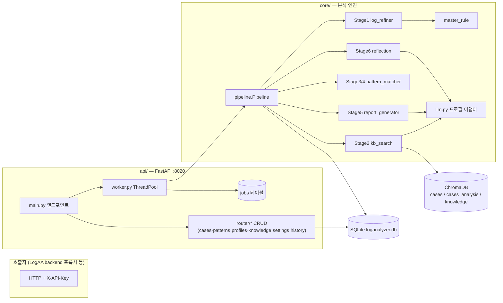

# AnalyzingAssistant_V2 기술 설계서

| 항목 | 값 |
| --- | --- |
| 작성일 | 2026-07-15 |
| **기준 커밋** | `d9938efbae3dbcc7bb23d96c02b96410b7c02968` (`d9938ef`, branch `docs-technical-writing-guide`) |
| 대상 | `AnalyzingAssistant_V2/` 디렉토리 전체 (약 10,400 라인) |
| 작성 기준 | [기술 문서 작성 가이드](./기술%20문서%20작성%20가이드.md) |

> 이 문서는 위 커밋 시점의 코드를 근거로 작성된 as-built 설계서이다.
> 이후 수정사항은 본 문서의 기준 커밋과 diff 하여 반영한다.

---

## 0. 목표 및 범위

AnalyzingAssistant_V2(이하 **AA V2**)는 리눅스 커널 로그를 입력받아 **규칙 기반 정제·패턴 매칭과 LLM 기반 검색·리포트 생성을 결합**해 문제를 자동 진단하는 분석 엔진 + REST API 서버이다.

- **범위 안**: `api/`(FastAPI 서버), `core/`(분석 파이프라인·저장소·LLM 어댑터), `config/`(파서·패턴·LLM·프로파일 설정), `ui/`(Streamlit 폼 컴포넌트), `db/`·`chroma_db/`(데이터 저장소).
- **범위 밖**: LogAA의 `backend/`(프록시 서버, `AnalyzingAssistant_client.py`로 AA V2 API를 호출), `frontend/`(React UI), `puller/`, `hippocampus/`. 이들은 §6.1에서 호출자로만 언급한다. (구버전 `AnalyzingAssistant/`는 2026-07-16 제거됨 — 시스템 설계서 §9-5)

## 1. 시스템 요구사항·제약 (코드 관찰 기반)

as-built 문서이므로 요구사항은 코드가 실제로 충족하는 동작에서 역산했다. 괄호는 근거 위치와 확신도.

| # | 요구사항 / 제약 | 근거 (확신도) |
| --- | --- | --- |
| R1 | 분석 요청은 비동기 job으로 처리하고, 진행률 조회·SSE 스트림·취소를 지원한다 | `api/main.py`, `api/worker.py` (high) |
| R2 | 분석은 Stage 1(정제)→2(KB 검색)→3/4(패턴 매칭)→5(리포트)→6(자기검증, 선택) 파이프라인으로 수행한다 | `core/pipeline.py` (high) |
| R3 | Stage 1/3/4는 순수 규칙 기반(LLM 비용 0), LLM은 Stage 2 Reranker·Stage 5/6·패턴/룰 생성에만 사용한다 | `log_refiner.py`, `pattern_matcher.py` 에 LLM 호출 없음 (high) |
| R4 | 판정은 "문제 / 불확실 / 알 수 없음" 3종이며 근거(evidence 로그 라인)를 리포트에 명시한다 | `report_generator.py`, `pipeline._append_source_summary()` (high) |
| R5 | 지식 자산(케이스·패턴·프로파일·사전지식)은 API로 CRUD 가능해야 하며, SQLite와 ChromaDB 임베딩을 동기 유지한다 | `api/router/*.py`, `kb_search.add_case()` (high) |
| R6 | 칩(chip) 정보로 케이스·패턴·사전지식을 필터/가중할 수 있다 | `chip_filter.py` (high) |
| R7 | 서버 재시작 시 진행 중이던 job은 클라이언트가 식별 가능한 취소 상태로 남긴다 | `job_store.mark_zombies_cancelled()` (high) |
| C1 | LLM은 로컬 Ollama(OpenAI 호환)를 기본으로 하되 Anthropic/Bedrock도 프로필로 교체 가능해야 한다 — 사내망(프록시·사설 CA) 제약 존재 | `core/llm.py`, `config/LLM/config.yaml` (high) |
| C2 | 케이스 리포트 스키마 v2의 조건부 필수 규칙은 API 계층(Pydantic)에서 강제한다 | `api/router/cases.py` §4.4, 확정 설계: `Document/로그분석 리포트 및 케이스 스키마 개선/케이스 스키마 개선 구현 설계.md` (high) |
| C3 | 모델 컨텍스트 한도(`num_ctx`)를 넘는 사전지식은 전략(truncation/split/hybrid/summarize_split)으로 처리한다 | `context_strategy.py` (high) |

## 2. 아키텍처 개요

**2계층 구조**: 상태 없는 분석 엔진(`core/`)과 이를 감싸는 job 기반 API 서버(`api/`). 엔진은 무거운 자원(ChromaDB 클라이언트, LLM 프로필)을 `Pipeline` 싱글턴에 담아 서버 기동 시 1회 로드하고, 요청마다 `ThreadPoolExecutor` 워커 스레드에서 `Pipeline.run()`을 실행한다. 상태(job·이력·지식)는 전부 SQLite/ChromaDB/JSON 파일에 저장되어 프로세스 자체는 재시작 가능하다.



Streamlit 진입점(`app.py`)도 존재하지만 멀티페이지 디렉토리(`pages/`)가 없어 현재는 DB 초기화 + 안내 화면만 동작한다(§9-5 참조). 실질 진입점은 `run_aa.sh`의 `uvicorn api.main:app --port 8020`이다.

## 3. 컴포넌트 설계

### 3.1 api/ — 서버 계층

| 컴포넌트 | 책임 | 비고 |
| --- | --- | --- |
| `api/main.py` | FastAPI 앱 조립, 분석 엔드포인트(`/analyze*`, `/health`), lifespan에서 worker startup/shutdown | 모든 라우터에 `Security(verify_api_key)` 일괄 적용 |
| `api/worker.py` | `Pipeline`·`ThreadPoolExecutor` 싱글턴 관리, job 제출/실행/취소, 진행률 콜백→job_store 기록, 주기적 TTL 정리 스레드 | 취소는 `threading.Event`를 `on_progress` 콜백에서 확인하여 stage 경계에서 적용 |
| `api/job_store.py` | `jobs` 테이블 CRUD. 상태 기계: `pending→running→done/error/cancelled` | startup 시 좀비 job을 `cancelled`("서버 재시작으로 취소됨")로 마킹 후 완료 job 즉시 purge |
| `api/auth.py` | `X-API-Key` 헤더 검증. 키 출처: env `LOGAA_API_KEY` + `config/api_keys.txt` | 키 미등록 시 기본 401 차단, `LOGAA_ALLOW_EMPTY_KEYS=true`일 때만 우회(ERROR 로그) |
| `api/models.py` | `AnalyzeRequest` / `SubmitResponse` / `JobStatusResponse` / `HealthResponse` | §4.2 |
| `api/router/*` | 지식 자산 CRUD 6종 (§4.1 표) | `cases.py`는 모듈 레벨 `KBSearch` 싱글턴으로 ChromaDB 동기화 수행 |

### 3.2 core/ — 분석 엔진

| 컴포넌트 | 책임 |
| --- | --- |
| `pipeline.py` | Stage 오케스트레이션(§6.2). MoE 앙상블 라우팅·후보 풀·winner 선정, fallback, unknown 재정제, 이력 저장까지 전 흐름 소유 |
| `log_loader.py` | 파일/폴더 → `{경로: 내용}` 로드. chardet 인코딩 감지, 바이너리(null byte) 스킵, 50MB 초과 시 스트리밍 읽기(`LOG_LOADER_STREAM_THRESHOLD_MB`) |
| `log_refiner.py` | **Stage 1**: ⓪ 키워드 prefilter(파일+라인, OR) → 1-4 파일 선별(regex AND) → 1-1 파서 매칭(비커널 라인 제거) → 1-2 반복/버스트 collapse(repeat 마커 흡수, 연속 중복, fingerprint 버스트) → 1-3 시간 윈도우(ts 직접 지정 > 앵커 ± window > 전체). **Stage 3** 헬퍼: `refine_for_case`(HIT, 케이스 keywords 공유 필터) / `refine_for_patterns`(MISS, 패턴별 필터·빈 결과 제외) |
| `parser_registry.py` + `config/log_parsers.yaml` | 로그 형식 파서 3종(dmesg/syslog_kern/journal_kern)을 YAML 선언으로 관리 — 코드 수정 없이 파서 추가 가능. `default: true`는 dmesg만 |
| `master_rule.py` | L_common → L_normalized 전역 정규화. 현재 rule_type은 `DEDUP_CONSECUTIVE` 1종. LLM 기반 자연어→룰 생성기(`MasterRuleGenerator`, 재시도 3회) 포함 |
| `kb_search.py` | **Stage 2**: (A) BGE-M3 임베딩으로 ChromaDB `cases`+`cases_analysis` 2컬렉션 검색 후 min-distance 융합 → (B) LLM Reranker가 후보 일괄 채점, `relevance_score ≥ kb_threshold`(0.70)만 HIT, 최대 `max_candidates`(3)건. Reranker는 전용 LLM 프로필 + fallback 프로필 재시도. pinned 케이스 직접 로드 경로 제공 |
| `chip_filter.py` | chip_tags 필터 공통 규칙: 태그 없음=공통(항상 통과), defect chip 없음=필터 안 함. `chip_match_mode`: `weight`(순위 우대, 기본)/`filter`(하드 컷) |
| `pattern_matcher.py` | **Stage 4**: 패턴 5타입(PRESENCE/SEQUENCE/WINDOW/ABSENCE/COMPOSITE) regex 매칭. COMPOSITE은 비-COMPOSITE 결과에 AND/OR/NOT 적용. `score = Σ(weight×matched)/Σweight` |
| `report_generator.py` | **Stage 5**: score 기준 판정(≥`definite_threshold` 0.5 → "문제", 매칭 0건 → "알 수 없음", 그 외 "불확실") 후 verdict별 프롬프트로 Markdown 리포트 생성. "알 수 없음"이면 `PatternGenerator`로 KB 추가 후보 생성. 컨텍스트 전략(§C3) 적용 지점 |
| `reflection.py` | **Stage 6**(선택): 리포트를 evidence·정제 로그와 대조해 근거 없는 항목 제거/`[추정]` 표기. `### REFLECTION_NOTES`/`### REPORT_FINAL` 파싱, 실패 시 Stage 5 원본 폴백 |
| `context_strategy.py` | 토큰 추정(3자≈1토큰, 오버헤드 4,000토큰)과 truncation(우선순위: 시스템 지침 > 프로파일 지침 > 사전지식)/split(청크 순차 보완)/overflow 비율 계산 |
| `profile.py` + `core/config/analysis_profile_config.py` | 분석 프로파일(JSON 파일, `config/profiles/*.json`) CRUD·병합. `MergedProfile` = 지침 연결 + prefilter 키워드 합집합 + 사전지식(카테고리/칩 필터 후 SQLite 본문·ChromaDB ID 분리) |
| `knowledge.py` | `domain_knowledge` CRUD(SQLite↔ChromaDB `knowledge` 컬렉션 동기화), 유사도 검색, 카테고리/칩 필터 |
| `pattern_generator.py` / `pattern_seeder.py` / `pattern_db.py` | 자연어→패턴 LLM 생성(+기존 패턴 관계 분석, pydantic 검증·재시도 3회) / `default_patterns.yaml` 시드(빈 DB일 때만) / 패턴 INSERT 공유 헬퍼 |
| `llm.py` | LLM 어댑터: provider `openai`(호환 API·스트리밍·json_mode) / `anthropic` / `anthropic-bedrock`(프록시·CA·리전은 config `bedrock` 섹션에서 로드, §9-2 해소). `chat` / `chat_with_profile` / `chat_stream`(취소 지원) / `embed` |
| `core/config/` | `config/LLM/config.yaml` facade. dotted-path 접근자(`get_str` 등), 프로필 리졸버(`active_llm`/`active_embed`/`reranker_llm`), 호출 시점 로드로 런타임 설정 변경 즉시 반영 |
| `observability.py` | Stage별 payload를 메모리 버퍼에 모아 완료 시 `analysis_logs`에 일괄 flush. `pipeline.observability_enabled`로 on/off, 비활성 시 no-op |
| `db.py` | 스키마 정의 + `_migrate()`(ALTER TABLE 추가 컬럼, `duplicate column name`만 무시) + 커넥션 컨텍스트 매니저(FK ON, commit/rollback) |

## 4. 인터페이스 / 계약

### 4.1 REST API 요약 (모든 엔드포인트 `X-API-Key` 필수)

| Prefix | 엔드포인트 | 용도 |
| --- | --- | --- |
| (root) | `POST /analyze` → 202 `{job_id}` · `GET /analyze/{job_id}` · `GET /analyze/{job_id}/stream`(SSE) · `DELETE /analyze/{job_id}`(취소) · `GET /health` | 분석 job 수명주기 |
| `/cases` | CRUD + `POST /sync`(ChromaDB 전체 재임베딩) + `/{cid}/patterns/{pid}` 연결/해제 + `/{cid}/references` 외부 참조 관리 | 케이스는 SQLite 저장과 동시에 ChromaDB upsert/delete |
| `/patterns` | CRUD (`?type=` 필터, 타입별 세부 필드 포함 단건 조회). 패턴 삭제 시 참조하는 COMPOSITE도 연쇄 삭제 | |
| `/profiles` | 분석 프로파일 CRUD (파일 기반, 이름이 키) | |
| `/knowledge` | 사전지식 CRUD (store_type에 따라 ChromaDB 동기화) | |
| `/settings` | 활성 프로필/시스템 지침/파이프라인·서버 설정/LLM·Embedding·Reranker 프로필 조회·저장, 연결 확인, 모델 목록 | `config.yaml`을 읽고 쓰는 관리 API |
| `/history` | 목록(limit/offset) · 단건(result + analysis_logs 포함) · 삭제/전체 삭제 | |

### 4.2 분석 요청 계약 (`AnalyzeRequest`)

`problem_text`(필수), `log_paths`(필수, **서버 로컬 경로** — 파일/폴더 혼합), `log_path_base`(출처 표기용 상대화 기준), `profile_names`, `pinned_case_name`(Stage 2 우회), `recursive`, `parser_names`(빈 값이면 default 파서=dmesg만), `input_keywords`/`anchors`(Stage 1), `chip`(칩 필터), `defect_id`(이력 기록용).

결과 dict(`_serialize_result`)는 `verdict`, `report_md`, `matched_case`, `match_result`(matched/unmatched·score), `minority_reports`, `winner_profile_names`, `reflection_notes`, `history_id`, `selected_logs`, `warnings`, `traversal_mode`를 포함한다.

### 4.3 SSE 스트림

`GET /analyze/{job_id}/stream`은 0.5초 간격으로 jobs 테이블을 폴링해 `updated_at` 변경 시에만 이벤트를 전송한다. 이벤트: `progress`(status/stage/progress) → 종결 이벤트 `done`/`error`/`cancelled` 후 스트림 종료. 진행률은 worker가 5~95% 구간을 stage 수(reflection off 6 / on 7)로 배분하고 완료 시 100%.

### 4.4 케이스 스키마 v2 조건부 검증 (`CaseSaveRequest`, 422 한국어 메시지)

- `verdict`는 저장 요청에서 **항상 필수** (`defect`/`no_defect`/`undetermined`; DB NULL은 레거시 행만).
- `defect` → `symptom_module`·`defect_area_type` 필수; `defect_area_type=module` → 모듈명, `external`/`verification` → 하위 항목 1개 이상.
- `undetermined` → `undetermined_reason` 필수; 사유 `other` → 서술 필수.
- 조치(`actions`, 복수 선택): `fix` 선택 → entries 1개 이상·각 entry에 module 필수, `keep` 선택 → detail 필수(`accept_defect`는 사유 필수), `handover` 선택 → owner 필수.
- `analysis_date`는 `YYYY-MM-DD` 형식 검증(빈 문자열은 None 처리).

이 규칙은 LogAA `backend/routers/cases.py` 프록시 Pydantic과 **양쪽 동기 수정**이 전제다(프록시가 모르는 필드는 조용히 탈락).

## 5. 데이터 모델

### 5.1 SQLite (`db/loganalyzer.db` — `core/db.py`)

| 테이블 | 내용 |
| --- | --- |
| `patterns` | 5타입 공용 테이블(타입별 컬럼 혼재: `pattern`, `window_sec`, `trigger_pattern`/`absent_pattern`, `operator` 등) + `keywords`(JSON) + `weight` + `is_required` + `analysis_guidelines` + `chip_tags`(JSON) |
| `pattern_steps` / `pattern_components` | SEQUENCE 단계 / COMPOSITE 구성 참조 (CASCADE) |
| `cases` | KB 케이스. `description`(임베딩 대상)·`analysis`·`keywords`·`profile_refs`(JSON)·`chip_tags` + **리포트 v2 컬럼군**(analyst, owner_module, analysis_date, log_source, verdict+CHECK, symptom_module, defect_area_*, undetermined_reason*, verdict_rationale, actions(JSON), notes) |
| `case_patterns` / `case_references` | 케이스↔패턴 다대다 / 외부 이슈 참조(Jira 등) |
| `noise_patterns` | 스키마만 존재 — 현재 정제 코드에서 미사용 (§9-4) |
| `master_rules` | 전역 정규화 룰 (`DEDUP_CONSECUTIVE`) |
| `history` | 분석 이력: `input_hash`(SHA256(problem+로그 전체)), `result`(JSON), `defect_id` |
| `analysis_logs` | Observability: history_id별 stage/payload(JSON 자유 스키마) |
| `domain_knowledge` | 사전지식: `store_type`(`sqlite`=본문 직접 주입 / `chromadb`=임베딩 검색), `category`/`sub_category`/`chip_tags` |
| `jobs` (`api/job_store.py`) | job 상태 저장소 — core 스키마와 분리 관리 |

스키마 변경은 `_migrate()`에 ALTER TABLE 문 추가 방식(멱등)으로만 수행한다.

커넥션은 `get_conn()`이 WAL 저널·busy_timeout 10초·synchronous=NORMAL을 공통 적용한다(§9-7 해소). WAL은 DB 파일 속성이라 최초 1회만 전환되며, 파일 옆에 `-wal`/`-shm`이 생성될 수 있으므로 **백업(파일 복사) 시 함께 복사**하거나 체크포인트 후 복사한다.

### 5.2 ChromaDB (`chroma_db/`, cosine)

| 컬렉션 | 문서 | 용도 |
| --- | --- | --- |
| `cases` | 케이스 `description` | Stage 2A 1차 검색 |
| `cases_analysis` | 케이스 `analysis` (비어 있으면 항목 삭제) | 증상이 달라도 원인이 같은 케이스 보강 — 두 컬렉션 중 낮은 distance를 대표값으로 채택 |
| `knowledge` | `store_type='chromadb'` 사전지식 본문 | problem_text 유사도 top-3 검색으로 컨텍스트 enrichment |

ID는 모두 SQLite PK 문자열이며, SQLite가 원본(source of truth), ChromaDB는 파생 인덱스다(`POST /cases/sync`로 전체 재구축 가능).

### 5.3 파일 기반 설정

- `config/LLM/config.yaml`: LLM/Embedding/Reranker 프로필, `pipeline.*`(임계값·MoE·컨텍스트 전략·observability), `server.*`(워커 수·job TTL), `bedrock.*`(프록시·CA 인증서·리전 — 비우면 SDK/환경 기본값), 시스템 분석 지침. 기준 커밋 시점 주요 값: `moe_traversal_mode: ensemble`, `moe_per_expert_stage1: true`, `num_ctx: 198000`, `context_strategy: truncation`, `stage6_reflection_enabled: false`, `chip_match_mode: weight`, `unknown_refine_mode: current`.
- `config/profiles/*.json`: 분석 프로파일(1파일=1프로파일).
- `config/patterns/default_patterns.yaml`: 최초 시드 패턴.
- `config/api_keys.txt`: API 키 목록(평문, §9-3).

## 6. 데이터 & 제어 흐름

### 6.1 분석 job 수명주기

1. 호출자(LogAA backend 프록시)가 `POST /analyze` → `create_job()`(pending) → `ThreadPoolExecutor.submit()` → 202 `{job_id}` 즉시 반환.
2. 워커 스레드(`_run_job`): 로그 로드(`load_inputs`) → 경로 상대화 → 프로파일 병합(`merge_profiles`) → `RefineConfig` 조립(파서 선택: 요청 지정 or default) → `Pipeline.run()` 실행. `on_progress` 콜백이 진행률을 jobs 테이블에 기록하며, 콜백마다 취소 이벤트를 확인해 `_JobCancelledError`로 중단한다(LLM 호출 도중에는 `chat_stream`의 청크 단위 취소만 가능).
3. 완료 시 결과 직렬화 후 `done`, 예외 시 `error`(surrogate 문자 정리), 취소 시 `cancelled`. 완료 job은 TTL(60분) 후 백그라운드 스레드가 삭제.

### 6.2 파이프라인 Stage 흐름 (`Pipeline.run`)

```
raw_logs ─Stage1→ L_common ─MasterRule→ L_normalized
                                   │
              초기 knowledge_context 조립 (프로파일 지식 or 전체 지식, chip 필터)
                                   │
        ┌── single / pinned ───────┴──── ensemble / first_hit ──┐
        │ Stage2: 벡터검색+Reranker      라우터 v2: 활성 전문가 선정   │
        │ (pinned이면 검색 우회)          (상황 축: 전역 케이스 검색     │
        │ HIT 시 케이스 추천 프로파일      sim ≥ floor → profile_refs   │
        │ 자동 병합 + 지식 enrichment     원인 축: 패턴 keyword 매치     │
        │                              → case → profile_refs,        │
        │                              Seed 무조건 + 상위 N + 전역)    │
        │                              전문가별 Stage2 실행(임베딩 재사용,│
        │                              per_expert면 Stage1 재정제)     │
        │                              → 후보 풀 → case_id dedup →    │
        │                              winner=(S4점수,관련성,라우터점수) │
        └──────────────┬───────────────────────────────────────┘
                       │  (winner의 증강 프로파일·지식·정제 로그가 downstream에 연결)
        Stage3: HIT=케이스 keywords 재필터 / MISS=전체 패턴별 필터 (chip 필터)
        Stage4: 5타입 패턴 매칭 → score
                       │
        Fallback: HIT인데 score < definite_threshold → 전체 패턴 재시도,
                  점수가 더 높을 때만 채택 (원점수는 리포트에 표기)
        신규 재정제: 매칭 0건 & unknown_refine_mode=all_profiles →
                  전 프로파일 키워드 합집합으로 Stage1 재실행
                       │
        Stage5: verdict 판정 → 컨텍스트 전략 적용 → LLM 리포트
                ("알 수 없음"이면 PatternGenerator로 KB 후보 생성)
        Stage6: (설정 시) Reflection 자기검증, 실패 시 원본 유지
                       │
        근거 로그 출처 append → history 저장 → analysis_logs flush
```

- **MoE 라우터 v2**는 "케이스를 먼저 보고 프로파일을 역산"한다 — v1(프로파일 사전지식 유사도)은 정답 프로파일을 놓치는 구조적 결함으로 폐기(코드 주석 `hist=97`, `pipeline._route_experts`).
- **minority reports**: winner 외 후보(score > 0)를 Stage 5 LLM 호출 없이 매칭 요약만 직렬화해 반환한다.
- problem 임베딩은 1회 계산해 모든 전문가 검색에 재사용한다.

## 7. 기술 선택

| 선택 | 근거(요구사항 연결) |
| --- | --- |
| FastAPI + ThreadPoolExecutor + SQLite `jobs` | R1·R7. 별도 브로커 없이 단일 프로세스로 비동기 job·재시작 복구를 해결. 파이프라인이 CPU+로컬 LLM 대기 위주라 스레드 풀로 충분 |
| SQLite 단일 파일 + ChromaDB persistent | R5. 운영 환경이 단일 서버·저동시성. ChromaDB는 SQLite 파생 인덱스로 두어 재구축 가능성 확보 |
| 규칙 기반 Stage 1/3/4 + LLM Stage 2B/5/6 분업 | R3. 반복 실행되는 정제·매칭은 결정적·무비용으로, 판단·서술만 LLM에 위임 |
| LLM 프로필 추상화 (`config.yaml` + provider 3종) | C1. 코드 수정 없이 모델/엔드포인트 교체, Reranker는 독립 프로필+fallback으로 격리 |
| 파서·패턴·프로파일의 선언적 설정(YAML/JSON) | 신규 로그 형식·시드 패턴·도메인 프로파일을 코드 배포 없이 추가 |
| pydantic 검증 + 오류 피드백 재시도(생성기 3회) | LLM 생성물(패턴/룰)의 스키마·regex·참조 무결성을 저장 전에 강제 |

## 8. 트레이드오프 & 대안 (코드에 기록된 결정)

| 결정 | 채택 이유 / 기각된 대안 |
| --- | --- |
| SSE를 0.5초 DB 폴링으로 구현 | 워커 스레드→async 간 직접 이벤트 전달 대신 jobs 테이블을 단일 진실로 유지 — 재시작·다중 구독에 안전. 대가: 최대 0.5초 지연 |
| 취소는 stage 경계 적용 | LLM 동기 호출 강제 중단 불가(문서화됨, `main.py cancel_analyze`). 스트리밍 경로만 청크 단위 즉시 취소 |
| MoE 라우터 v2 (케이스→프로파일 역산) | v1은 single보다 성능이 나빠지는 구조적 결함으로 교체(`_route_experts` docstring). 대가: 전문가 수만큼 Stage 2 반복 비용 — first_hit 모드·임베딩 재사용·per-expert Stage 1(LLM 비용 0)으로 완화 |
| Fallback은 점수가 "명확히 높을 때만" 채택 | 동점이면 케이스 전용 패턴 유지 — 케이스 맥락(분석지침 연결)을 잃지 않기 위함 |
| chip 기본 모드 `weight`(순위 우대) | 하드 필터는 케이스 누락 위험 — threshold는 원점수로 판정하고 정렬만 우대. 필요 시 `filter` 모드 선택 가능 |
| 케이스:리포트 = 1:1, 집계 축은 개별 컬럼+CHECK, 조치는 JSON 1컬럼 | 케이스 스키마 개선 확정안 C(하이브리드). 근거: `케이스 스키마 개선 구현 설계.md` |
| 새 v2 필드는 SQLite에만 (ChromaDB 임베딩 불변) | 검색 품질에 영향 없는 관리 필드로 임베딩 재구축 회피 (상동) |
| `analysis` 별도 임베딩 컬렉션 + min-distance 융합 | description만으로 약한 "증상 상이·원인 동일" 매칭 보강 (`kb_search.py` 주석). 대가: 컬렉션 2개 동기 유지 |
| 컨텍스트 전략 4종 중 기본 truncation | 우선순위 기반 절단이 가장 단순·저비용. num_ctx 198,000으로 실제 초과는 드묾 |

## 9. 위험 & 미해결 질문

| # | 항목 | 내용 (확신도) |
| --- | --- | --- |
| 1 | `patterns.is_required` 미구현 | 스키마 주석은 "미매칭 시 케이스 즉시 제외"인데 `pattern_matcher.py`·`pipeline.py`는 이 값을 참조하지 않음 — 점수 가중에만 의존 (high) |
| 2 | ~~`llm.py` Bedrock 경로의 하드코딩~~ → **해소** | 2026-07-16 해소 — 프록시 URL·CA 인증서 경로·리전을 `config/LLM/config.yaml` `bedrock` 섹션으로 이전(비어 있는 항목은 SDK/환경 기본값 적용), anthropic import를 lazy 전환(미설치 시에도 모듈 로드 가능, 호출 시점 안내 오류), `print()` 디버그 제거 |
| 3 | API 키 평문 저장 | `config/api_keys.txt` 평문 + 저장소 포함 여부 관리 필요 (high) |
| 4 | `noise_patterns` 테이블 미사용 | 스키마 헤더는 "Stage 1-1에서 제거할 라인 패턴"이나 정제 코드에 소비자가 없음 (high) |
| 5 | Streamlit UI 불완전 | `app.py`가 안내하는 Pages(`pages/`)가 없고 `ui/pattern_form.py`가 참조하는 Page 3/4도 부재. 단 이 UI는 운용 대상이 아니라 **기능 확인·디버깅 목적**임(2026-07-15 사용자 확인) — 운영 진입점은 API 서버 |
| 6 | ~~`db/aa.db` 잔재~~ → **해소** | 2026-07-16 해소 — 참조 코드 없음(전체 grep 0건)·재생성 코드 없음을 확인 후 git 추적 파일 삭제. 실사용 DB는 `loganalyzer.db`(git 미추적), 디렉토리 유지는 `.gitkeep` |
| 7 | ~~SQLite 동시성~~ → **해소** | 2026-07-16 해소 — `get_conn()`(전 접근 경로 공통)에 WAL 저널 + busy_timeout 10초 + synchronous=NORMAL 적용. 읽기(SSE 폴링)↔쓰기(워커) 상호 차단 제거, 쓰기 경합은 대기로 흡수 (부하 테스트: 기존 9건 → 운영 설정 0건). 백업 시 `-wal`/`-shm` 동반 복사 필요(§5.1). 다중 호스트 확장 시 재검토는 시스템 설계서 §9-6이 관리 |
| 8 | `history.result`와 직렬화 경로 이원화 | `_save_history` payload와 worker `_serialize_result`가 별도 포맷 — 필드 추가 시 양쪽 수정 필요 (high) |

## 10. 확정 이력

| 일자 | 내용 |
| --- | --- |
| 2026-07-15 | 최초 작성. 기준 커밋 `d9938ef` (as-built, 코드 전수 탐독 기반) |
| 2026-07-15 | 사용자 리뷰 반영: §9 "포트 문서 불일치" 항목 제거 — `api/main.py` docstring은 사용 예시이고 실제 구동 기준은 `run_aa.sh`이므로 위험 아님 |
| 2026-07-15 | 사용자 리뷰 반영(§9 전 항목 확정): is_required·Bedrock 하드코딩·API 키 평문·noise_patterns·aa.db·SQLite 동시성·직렬화 이원화는 **기록 유지**(추후 검토/정리 예정), Streamlit UI 항목에 목적(기능 확인·디버깅용) 추가, "Reranker 설정 값" 항목 제거 — 운영 시 변경 가능한 환경 설정이라 현시점 확인 불요 |
| 2026-07-16 | §9-2 해소 표기 — Bedrock 프록시·CA·리전을 `config/LLM/config.yaml` `bedrock` 섹션으로 이전, anthropic lazy import 전환, `print()` 제거 (커밋 `3a79638`). §3.2 `llm.py`·§5.3 설정 기술 갱신 |
| 2026-07-16 | §9-6 해소 표기 — 미사용 `db/aa.db`(1바이트 빈 파일) git 추적 삭제. 참조·재생성 코드 없음 확인 |
| 2026-07-16 | §9-7 해소 표기 — `get_conn()`에 WAL 저널·busy_timeout 10초·synchronous=NORMAL 적용, §5.1에 백업 주의 추가. 동시 부하 테스트(10 writer × 100 ops + 5 reader)로 기존 9건 → 0건 확인 |
