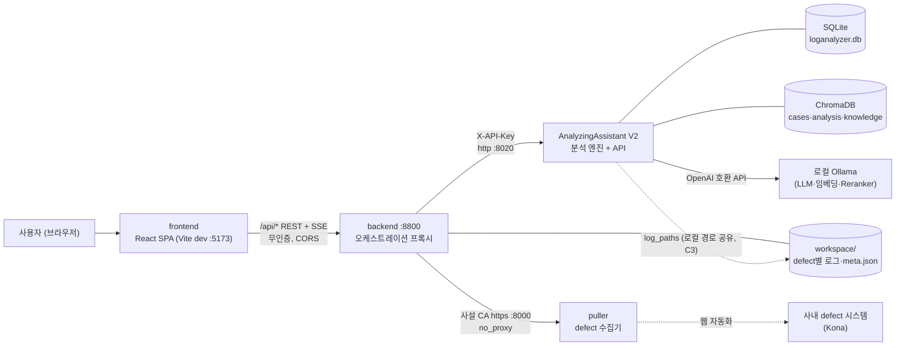

# LogAA 시스템 기술 설계서

| 항목 | 값 |
| --- | --- |
| 작성일 | 2026-07-15 |
| **기준 커밋** | `18f100bf7d81e280c194980754a5ec31b43315a9` (`18f100b`, branch `docs-technical-writing-guide`) |
| 대상 | LogAA 저장소 전체 (시스템 수준 통합 관점) |
| 작성 기준 | [기술 문서 작성 가이드](./기술%20문서%20작성%20가이드.md) |
| 하위 설계서 | [frontend](./frontend%20기술%20설계서.md) · [backend](./backend%20기술%20설계서.md) · [AnalyzingAssistant_V2](./AnalyzingAssistant_V2%20기술%20설계서.md) |

> 이 문서는 서브시스템 설계서 3종을 종합한 **시스템 수준** as-built 설계서이다.
> 서브시스템 내부 구조는 재진술하지 않고 해당 설계서를 참조한다. 이후 수정사항은 기준 커밋과 diff 하여 반영한다.

---

## 0. 목표 및 범위

LogAA(Log Analyzing Assistant)는 **사내 defect 관리 시스템의 문제(defect)를 가져와 커널 로그를 자동 진단하고, 분석 결과를 지식 베이스(케이스·패턴)로 축적해 다음 진단의 정확도를 높이는** 로그 분석 어시스턴트 시스템이다.

### 저장소 구성 요소 분류

| 구성 요소 | 분류 | 상태 / 문서화 |
| --- | --- | --- |
| `frontend/` | **핵심 서브시스템** — 사용자 UI (React SPA) | [설계서](./frontend%20기술%20설계서.md) 작성 완료 |
| `backend/` | **핵심 서브시스템** — 오케스트레이션 프록시(BFF) | [설계서](./backend%20기술%20설계서.md) 작성 완료 |
| `AnalyzingAssistant_V2/` | **핵심 서브시스템** — 분석 엔진 + API 서버 | [설계서](./AnalyzingAssistant_V2%20기술%20설계서.md) 작성 완료 |
| `puller/` | 서브시스템 — defect 시스템 수집기 (웹 자동화 + API, react/streamlit UI 포함) | [설계서](./puller%20기술%20설계서.md) 작성 완료 (2026-07-16) |
| `Document/` | 설계·스펙 문서 (본 시리즈, 케이스 스키마 개선 스펙 등) | — |
| `analysis_upgrade`, `report.md` | 작업 노트 (개선 아이디어·오류 메모) | 비정식 문서 |
| `hippocampus/`, `expert-claude/`, `db/`, `chroma_db/`, `.venv/` | 저장소 외 취급(.gitignore) — 개인 노트·에이전트 설정·런타임 데이터·공유 가상환경 | — |

## 1. 시스템 요구사항·제약 (종합)

서브시스템 설계서의 요구사항을 시스템 수준으로 종합한다. 상세 근거는 각 설계서 §1 참조.

| # | 시스템 요구사항 / 제약 | 실현 위치 |
| --- | --- | --- |
| S1 | defect ID 하나로 문제 설명·첨부 로그를 자동 수집하고 defect별 워크스페이스로 관리한다 | backend(R1) ← puller |
| S2 | 수집된 로그를 규칙 기반 정제·패턴 매칭 + LLM 검색·리포트의 6-Stage 파이프라인으로 진단하고, 진행률을 실시간(SSE)으로 사용자에게 전달한다 | AA V2(R1~R4) → backend(R2) → frontend(R2) |
| S3 | 판정은 "문제/불확실/알 수 없음" 3종 + evidence 로그 근거를 갖춘 Markdown 리포트로 산출한다 | AA V2(R4), frontend(R4) |
| S4 | 분석 지식(케이스·패턴·프로파일·사전지식)은 UI로 CRUD하며, 케이스 리포트는 스키마 v2(판정·조치 분류 체계)를 따른다 | frontend(R6,R7) → backend(R5,R6) → AA V2(R5,C2) |
| S5 | 케이스로 축적된 지식은 즉시 다음 분석의 검색·매칭 대상이 된다 (지식 축적 루프, §6.3) | AA V2(Stage 2~4) |
| S6 | 칩(chip) 정보를 SW Version에서 해석해 케이스·패턴·사전지식 매칭에 반영한다 | backend(R3) → AA V2(R6) |
| S7 | 분석 이력을 defect_id로 추적·조회할 수 있다 | AA V2(history) ↔ frontend(HistoryPage) |
| C1 | **사내망 제약**: 프록시 환경(no_proxy 우회 필요), Puller는 사설 CA HTTPS, LLM은 로컬 Ollama 기본(외부 API는 프로필 교체) | backend(C1,C2), AA V2(C1) |
| C2 | **단일 호스트 배포**: 세 서버가 127.0.0.1 포트로 상호 참조, 저장소는 파일시스템·SQLite·ChromaDB — 별도 인프라(DB 서버·브로커) 없음 | 전 서브시스템 |
| C3 | backend↔AA 간 로그 전달은 **서버 로컬 경로** 공유로 이루어진다(파일 업로드 아님) — 두 서버가 같은 파일시스템을 봐야 함 | backend §6.2, AA V2 §4.2 |

## 2. 전체 아키텍처

**4계층 파이프라인 아키텍처**: UI(SPA) → 오케스트레이션 프록시(BFF) → 분석 엔진, 그리고 엔진 뒤의 저장소·LLM. 상태는 아래로 갈수록 무거워진다 — frontend는 브라우저 스토리지 수준, backend는 파일(workspace), AA V2가 영속 데이터(SQLite·ChromaDB)의 소유자다.



### 배포 토폴로지 (기준 커밋 시점)

| 프로세스 | 기동 | 포트 | 비고 |
| --- | --- | --- | --- |
| frontend | `frontend/run_frontend.sh` (Vite dev) | 5173(기본) | `VITE_API_URL`로 backend 지정 |
| backend | `backend/run_backend.sh` (uvicorn) | 8800 | `no_proxy` env 설정 포함 |
| AA V2 | `AnalyzingAssistant_V2/run_aa.sh` (uvicorn) | 8020 | worker 스레드 풀 내장 |
| puller | (저장소 내, 기동 스크립트 미확인) | 8000(https) | backend `config.yaml` 기준 |
| Ollama | 별도 설치 | 11434 | AA `config/LLM/config.yaml` 기준 |

세 파이썬 서버는 루트 공유 가상환경(`.venv/`) 하나를 사용한다. 각 `run_*.sh`가 수동 기동 방식이며 서비스 관리자(systemd 등) 구성은 없다.

### 신뢰 경계

인증은 **backend↔AA 구간(X-API-Key)에만** 존재한다. 사용자↔frontend↔backend 구간은 무인증 + CORS 전면 허용으로, 시스템의 보안 경계는 사실상 네트워크(사내망 접근 통제)에 위임되어 있다 (§9-1).

## 3. 서브시스템 구성 요약

| 서브시스템 | 역할 한 줄 | 기술 | 규모 | 자체 상태 |
| --- | --- | --- | --- | --- |
| frontend | defect 선택→분석 실행→리포트 열람과 지식 자산 관리 UI | React 19 + Vite, react-markdown | ~4.7k LoC(JS/JSX) | 없음(브라우저 스토리지만) |
| backend | Puller 수집·워크스페이스 관리·AA 중계의 얇은 async 프록시 | FastAPI + httpx | ~1.6k LoC | workspace 파일 |
| AA V2 | 6-Stage 분석 파이프라인 + 지식 저장소 + job 서버 | FastAPI + ThreadPool, SQLite, ChromaDB, Ollama | ~10.4k LoC | SQLite·ChromaDB·config |

각 서브시스템의 컴포넌트 상세·내부 흐름·자체 위험 목록은 해당 설계서 §3~§9를 참조한다.

## 4. 시스템 인터페이스 / 계약

### 4.1 내부 계약 3종

| 계약 | 프로토콜 / 인증 | 내용 | 정의 위치 |
| --- | --- | --- | --- |
| frontend ↔ backend | REST + SSE, 무인증 | `/api/*` 전체 — backend 설계서 §4.1 표가 규범 | `backend/routers/*`, `frontend/src/api/*` |
| backend ↔ AA V2 | REST + SSE, `X-API-Key` | 분석 job·지식 CRUD·설정·이력 — AA 설계서 §4가 규범 | `AnalyzingAssistant_client.py` ↔ `api/` |
| backend ↔ puller | REST(https, 사설 CA) | defect 본문/파일/댓글첨부 수집 — backend 설계서 §4.3이 소비자 관점 규범 | `puller_client.py` |

오류는 AA의 상태코드·detail이 backend를 거쳐 frontend `Error.message`까지 **원문 전파**되는 것이 규약이다(케이스 v2 422 한국어 메시지가 사용자에게 그대로 표시). 2026-07-16부터 전 AA 프록시 라우터가 준수한다(공용 헬퍼 `routers/_errors.py`, SSE 스트림만 구조상 제외 — backend §9-5 해소).

### 4.2 계약 동기화 규칙 (시스템 수준 불변식)

- **케이스 스키마 v2 삼중 미러**: 필드 목록·조건부 필수 규칙이 세 곳에 존재한다 — frontend `validateReport`(UX 선검증) / backend `CaseSaveRequest` 미러(필드 필터) / AA `model_validator`(**최종 규범**). 필드 추가·규칙 변경 시 **세 곳 동시 수정**이 필수이며, 누락 시 backend에서 조용한 필드 유실이 발생한다. 원본 스펙: `Document/로그분석 리포트 및 케이스 스키마 개선/`.
- **분석 결과 형태**: AA `_serialize_result`가 원본이고 frontend `ResultPanel`이 소비자 — 필드 추가 시 AA `history` 저장 포맷(별도, AA §9-8)도 함께 검토한다.
- **SSE 이벤트 4종**(progress/done/cancelled/error): AA가 발행, backend는 바이트 패스스루, frontend가 파싱 — 이벤트 스키마 변경은 AA·frontend 양단 수정.

### 4.3 외부 의존

사내 defect 시스템(현재 "Kona" 단일)은 puller가 웹 자동화로 접근한다. defect 시스템 추가 시 puller 설정 확장 외에 frontend의 시스템명 의존(frontend §9-3 — 시스템별 frontend 분리 운영까지 검토)이 영향 범위다. 현재 추가 계획 없음(2026-07-15 사용자 확인).

## 5. 데이터 아키텍처

### 5.1 데이터 소유권

| 데이터 | 소유자 | 저장소 | 비고 |
| --- | --- | --- | --- |
| defect 원본(로그·첨부·meta.json) | backend | `backend/workspace/<defect_id>/` | 파일이 곧 상태 (DB 없음) |
| 지식 자산(케이스·패턴·프로파일·사전지식·마스터룰) | AA V2 | SQLite + ChromaDB(파생 인덱스) + `config/profiles/*.json` | SQLite가 원본, ChromaDB는 재구축 가능 |
| 분석 이력·stage 로그 | AA V2 | SQLite `history`·`analysis_logs` | `defect_id` 컬럼으로 backend 도메인과 연결 |
| job 상태 | AA V2 | SQLite `jobs` | TTL 정리, 재시작 시 좀비 취소 |
| 설정 | 각 서브시스템 | `config.yaml`(backend·AA), `.env`(frontend), YAML/JSON 선언 파일 | §10 확장 지점 |

### 5.2 도메인 식별자의 흐름 (추적성)

- **defect_id**: 사용자 입력 → puller 수집 → workspace 디렉토리명·meta.json → 분석 요청 → AA `history.defect_id` → 이력 필터·리포트 파일명. 시스템 전체를 관통하는 유일한 도메인 키.
- **chip**: puller가 수집한 `SW_Version` 텍스트 → backend `chip_resolver`(YAML 매핑) → meta.json → 분석 요청 → AA `chip_filter`(케이스·패턴·사전지식의 `chip_tags` 대조: weight 우대 또는 filter 컷). 매핑 미히트 시 null = 필터 미적용.
- **케이스 ↔ defect 연결**: 분석 후 사용자가 리포트에서 등록하면 `case_references(system="Kona", reference_id=defect_id)`로 영속 — 케이스가 어떤 defect들에서 확인됐는지의 이력이 된다.

## 6. E2E 데이터·제어 흐름

### 6.1 defect 수집

frontend(Sidebar) → backend `POST /api/defect/fetch` → puller(본문 텍스트 + 첨부 다운로드·zip 해제 + 댓글 첨부) → chip 해석 → `meta.json` 저장 → frontend 목록 반영. 상세: backend §6.1.

### 6.2 분석 실행 (SSE 3-hop 체인)

frontend `submitAnalysis` → backend가 meta.json에서 `problem_text` 조립·파일 선택 반영 → AA `POST /analyze`(202 + job_id) → AA worker 스레드가 6-Stage 파이프라인 실행(상세: AA §6.2 — MoE 앙상블 포함) → 진행률이 AA jobs 테이블 → AA SSE → backend 바이트 패스스루 → frontend EventSource로 3-hop 전달 → done 이벤트의 결과로 리포트 렌더. 취소는 역방향 동일 경로(stage 경계 적용).

### 6.3 지식 축적 루프 (시스템의 학습 사이클)

```text
분석 실행 ─→ 리포트 (알 수 없음/불확실 판정 + KB 추가 권고)
   ↑                    │
   │                    ▼ 사용자 판단
   │         케이스 등록 (스키마 v2: 판정·조치·분석 내용)
   │         + 패턴 연결 (5타입) + defect 참조 등록
   │                    │
   │                    ▼ 저장 시 즉시
   └── ChromaDB 임베딩(description·analysis) — 다음 분석의
       Stage 2 검색·Stage 3/4 매칭·MoE 라우팅 대상에 편입
```

이 루프가 시스템의 존재 이유다: 케이스가 쌓일수록 "알 수 없음"이 "문제(자동 진단)"로 전환된다. 루프의 품질을 좌우하는 계약이 케이스 스키마 v2(§4.2)와 패턴 정의(AA §5.1)다.

## 7. 시스템 수준 기술 선택

| 선택 | 근거 |
| --- | --- |
| 3-서버 분리(SPA / BFF / 엔진) + 프록시 계층 | 무거운 엔진(모델 로드·지식 저장소)을 UI 배포 주기와 분리, API 키를 backend에 격리, 프론트에는 단일 `/api/*` 표면 제공 |
| 인프라 없는 저장소(파일 + SQLite + 임베디드 ChromaDB) | 단일 호스트 사내 도구 — 운영 부담 최소화, 백업=파일 복사. 규모 한계는 §9-6 |
| 로컬 LLM(Ollama) 기본 + 프로필 교체 구조 | 로그(사내 데이터)를 외부로 보내지 않는 것이 기본값. 필요 시 Anthropic/Bedrock 프로필로 전환 가능 |
| 로그 전달을 경로 공유로(C3) | 대용량 로그의 업로드 왕복 제거. 대가: backend·AA의 동일 호스트(또는 공유 마운트) 결합 |
| 규칙(정규식·키워드) 우선, LLM은 판단·서술에만 | 반복 비용·재현성 — 같은 로그는 같은 정제·매칭 결과. LLM 변동성은 Stage 2B/5/6에 국한 |

## 8. 시스템 수준 트레이드오프

| 결정 | 채택 이유 / 대가 |
| --- | --- |
| BFF가 AA 스키마를 미러링(패스스루가 아닌 재정의) | 프론트 오류 메시지·필드 통제 한 지점 확보. 대가: §4.2 삼중 동기화 부담 — 시스템에서 가장 관리 비용이 큰 계약 |
| SSE 3-hop 체인 (AA→backend→frontend) | 프론트가 AA에 직접 붙지 않아 인증 경계 유지. 대가: 중계 지연(폴링 0.5s + 전달)과 장애 지점 증가 — 실사용상 무시 가능 수준 |
| 지식 축적을 자동이 아닌 사용자 승인 기반으로 | KB 오염 방지 — LLM의 KB 추가 제안(kb_suggestion)도 제안까지만. 대가: 축적 속도가 운영자 노력에 비례 |
| ~~V1을 삭제하지 않고 병존~~ | 2026-07-16 V1 제거로 종결(§9-5). 롤백은 git 이력으로 대체 |

## 9. 시스템 수준 위험 & 미해결 질문

서브시스템 내부 위험은 각 설계서 §9가 관리한다(전 항목 사용자 리뷰 완료). 여기는 **서브시스템 경계를 넘는** 항목만 둔다.

| # | 항목 | 내용 (확신도) |
| --- | --- | --- |
| 1 | 신뢰 경계가 네트워크에 전적으로 위임 | 무인증 frontend↔backend(CORS 전면 허용) + 평문 API 키/자격증명 통과 + backend의 파일시스템 접근 API(user-logs) 조합 — 사내망 접근자는 시스템 전체 권한. 개별 항목은 backend §9-1~3, 종합 대응(인증 도입 여부)은 미결 (high) |
| 2 | 케이스 v2 계약의 삼중 동기화 | §4.2 — 자동 검증 장치(공유 스키마·계약 테스트) 없이 주석 경고에 의존. 변경 절차 문서화 또는 스키마 단일화가 미결 (high) |
| 3 | 배포·기동 절차의 비공식성 | 수동 `run_*.sh` 3개 + 공유 `.venv` + frontend dev 서버 + puller 인증서 수동 배치 — 재현 가능한 설치·기동 문서는 `Readme.md`(개발 환경)뿐, 운영 절차·서비스화 미정 (high) |
| 4 | ~~puller 서브시스템 미문서화~~ → **해소** | 2026-07-16 [puller 설계서](./puller%20기술%20설계서.md) 작성으로 해소 — 잔여 위험은 해당 문서 §9에서 관리 |
| 5 | ~~V1(AnalyzingAssistant/) 레거시 잔존~~ → **해소** | 2026-07-16 해소 — V1이 현재 backend/frontend 계약(SSE `/stream`·cases/patterns/profiles/knowledge/history 라우터)과 호환 불가함을 확인하고 `AnalyzingAssistant/` 디렉토리·backend config V1 항목·V1 시절 죽은 클라이언트 코드 제거. 롤백은 git 이력 |
| 6 | 단일 호스트·단일 사용자 규모 전제 | 로그 경로 공유(C3), SQLite 동시성(AA §9-7), 인메모리 취소 이벤트 등은 다중 호스트·다수 동시 사용자 시 재설계 필요 — 현재 전제에서는 문제 없음 (high) |
| 7 | 자동화 테스트 부재 | 세 서브시스템 모두 테스트 코드 없음(검증은 세션 기반 수동·관통 테스트) — 회귀 안전망이 없어 §4.2 같은 다지점 계약 변경이 특히 취약 (high) |

## 10. 확장 지점 (코드 수정 없이 확장 가능한 것)

| 확장 | 방법 |
| --- | --- |
| 새 로그 형식 파서 | `AnalyzingAssistant_V2/config/log_parsers.yaml`에 항목 추가 |
| 새 칩/SW Version 매핑 | `backend/config/sw_version_chip_map.yaml`에 항목 추가 (프로세스 재시작 또는 캐시 초기화 필요 — backend §9-7 관련) |
| 분석 프로파일·사전지식·케이스·패턴 | UI에서 CRUD (지식 축적 루프 §6.3) |
| LLM/임베딩/Reranker 모델 교체 | 설정 UI 또는 `config/LLM/config.yaml` 프로필 |
| 새 Puller(defect 시스템) | `backend/config.yaml` pullers 항목 — 단 frontend 의존성 검토 필요(§4.3) |

## 11. 확정 이력

| 일자 | 내용 |
| --- | --- |
| 2026-07-15 | 최초 작성. 기준 커밋 `18f100b` — 하위 설계서 3종(각각 사용자 리뷰 완료본) 종합 + 주변 구성 요소(puller·V1 등) 분류 확인 |
| 2026-07-16 | 사용자 리뷰: §9 위험 항목 1~7 **전부 유지** 확정 — 추후 검토 예정 |
| 2026-07-16 | puller 설계서 작성에 따라 §0 분류표 갱신·§9-4 해소 표기 |
| 2026-07-16 | §9-5 해소 — 레거시 V1이 현 계약(SSE·지식/이력 라우터)과 호환 불가함을 확인 후 `AnalyzingAssistant/` 제거. §0 분류표·§8 트레이드오프 갱신 |
