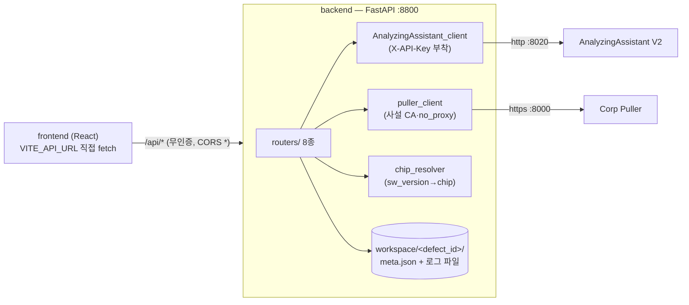

# backend 기술 설계서

| 항목 | 값 |
| --- | --- |
| 작성일 | 2026-07-15 |
| **기준 커밋** | `d0ae1dc880297bf29a1306056d3cd6aae7c784af` (`d0ae1dc`, branch `docs-technical-writing-guide`) |
| 대상 | `backend/` 디렉토리 전체 (약 1,550 라인) |
| 작성 기준 | [기술 문서 작성 가이드](./기술%20문서%20작성%20가이드.md) |
| 관련 문서 | [AnalyzingAssistant_V2 기술 설계서](./AnalyzingAssistant_V2%20기술%20설계서.md) |

> 이 문서는 위 커밋 시점의 코드를 근거로 작성된 as-built 설계서이다.
> 이후 수정사항은 본 문서의 기준 커밋과 diff 하여 반영한다.

---

## 0. 목표 및 범위

backend는 LogAA의 **오케스트레이션 프록시(BFF, Backend-for-Frontend)** 서버이다. React frontend가 호출하는 단일 진입점(`/api/*`)으로서 다음 세 가지를 담당한다:

1. **Defect 수집**: 사내 Puller 서버에서 문제(defect)의 설명·첨부파일을 가져와 로컬 워크스페이스에 저장
2. **분석 위임**: 워크스페이스의 로그를 AnalyzingAssistant V2(이하 AA)에 분석 요청하고 job 상태·SSE를 프록시
3. **지식 자산 패스스루**: AA의 케이스·패턴·프로파일·사전지식·설정·이력 CRUD를 프론트 경로로 중계

- **범위 안**: `backend/` 전체 — `main.py`, `config.py`/`config.yaml`, `AnalyzingAssistant_client.py`, `puller_client.py`, `chip_resolver.py`, `routers/`(8종), `config/sw_version_chip_map.yaml`, `workspace/`(런타임 데이터).
- **범위 밖**: AA V2 내부(별도 설계서), `puller/`(외부 서버), `frontend/`(호출자로만 언급).

## 1. 시스템 요구사항·제약 (코드 관찰 기반)

| # | 요구사항 / 제약 | 근거 (확신도) |
| --- | --- | --- |
| R1 | Puller에서 defect ID로 설명·첨부·댓글 첨부를 가져와 defect별 워크스페이스에 저장한다 (zip 자동 해제 포함) | `routers/puller.py`, `puller_client.py` (high) |
| R2 | 저장된 defect에 대해 AA 분석을 제출하고 진행 상황(폴링·SSE)·취소를 프론트에 중계한다 | `routers/analyze.py` (high) |
| R3 | SW Version 문자열에서 칩 정보를 해석해 meta에 저장하고 분석 요청에 전달한다 | `chip_resolver.py`, `routers/puller.py`·`analyze.py` (high) |
| R4 | 사용자가 서버 로컬 경로의 로그를 defect에 추가/조회/삭제할 수 있다 | `routers/user_logs.py` (high) |
| R5 | AA의 지식 자산·설정·이력 API를 프론트 경로(`/api/*`)로 중계하고 AA의 4xx/5xx를 그대로 전파한다 | `routers/cases.py`·`profiles.py`·`history.py`·`settings.py` (high; 단 §9-5의 예외 있음) |
| R6 | 케이스 저장 스키마(v2)는 AA와 **필드 목록을 동기 미러링**한다 — 프록시는 형태만 검증하고 조건부 필수 검증은 AA가 수행 | `routers/cases.py` 주석 (high) |
| C1 | 사내 프록시 환경 제약: Puller·AA는 내부망이므로 `no_proxy` 처리 필요 — httpx가 no_proxy CIDR를 미지원하여 `trust_env=False`로 우회 | `puller_client.py`, `run_backend.sh`, `config.yaml` (high) |
| C2 | Puller는 사설 인증서 HTTPS — `backend/certs/server.crt`를 CA로 신뢰 (저장소 미포함, 배포 시 배치 필요) | `puller_client.py` (high) |
| C3 | 별도 DB 없음 — 상태는 전부 `workspace/<defect_id>/meta.json` 파일에 저장 | `routers/puller.py` (high) |

## 2. 아키텍처 개요

backend는 **상태를 파일시스템에만 두는 얇은 async 프록시**다. 자체 도메인 로직은 defect 워크스페이스 관리와 칩 해석뿐이고, 나머지는 두 외부 서버(Puller, AA)로의 중계다. 모든 외부 호출은 httpx AsyncClient로 비동기 수행한다.



구동: `run_backend.sh` — `no_proxy` 환경변수(127.0.0.1, Puller IP) export 후 `uvicorn main:app --port 8800 --host 0.0.0.0`.

## 3. 컴포넌트 설계

| 컴포넌트 | 책임 | 비고 |
| --- | --- | --- |
| `main.py` | FastAPI 앱 조립: CORS 미들웨어(`allow_origins=["*"]`) + 라우터 8종 등록 + `/health` | 인증 미들웨어 없음 (§9-2) |
| `config.py` | `config.yaml` 로드 싱글턴(`config`). workspace 경로 해석(상대→backend 기준 절대), puller/AA 프로필 조회 | import 시 1회 로드 — 변경 시 서버 재시작 필요 |
| `config.yaml` | workspace 경로, `puller_client.no_proxy`, Puller 목록(url·site_name·async_fetch), AA 목록(`active` 선택, url·api_key) | AA V1 항목은 레거시 잔존, active는 V2 |
| `AnalyzingAssistant_client.py` | AA REST 전체를 감싼 async 클라이언트 싱글턴(`aa_client`). `X-API-Key` 헤더 자동 부착, 요청마다 새 AsyncClient 생성. `stream_url()`로 SSE 프록시용 (url, headers) 제공 | `analyze()`(제출+3초 폴링 동기 완주, 10분 타임아웃)도 있으나 현재 라우터는 `submit_analyze_job()`만 사용 (§9-8) |
| `puller_client.py` | Puller REST 클라이언트: defect 본문 fetch(동기 `/api/final` 또는 비동기 `/api/final/start`→`/api/job/{id}` 2초 폴링), 파일/댓글첨부 목록·스트리밍 다운로드(1MB 청크) | 사설 CA(`certs/server.crt`) 신뢰 + `no_proxy` 시 `trust_env=False` |
| `chip_resolver.py` + `config/sw_version_chip_map.yaml` | SW Version 문자열 부분 매칭(대소문자 무시, 순서대로 첫 히트)으로 칩 목록 해석. `lru_cache` 1회 로드, `reload()`로 캐시 무효화 | `reload()` 호출 API는 미노출 (§9-7) |
| `routers/puller.py` | Puller 목록·defect 목록(최신 20건)/단건 조회, **defect fetch 파이프라인**(§6.1) | 조회 시 `_ensure_chip()`이 chip 누락 meta를 lazy 갱신(파일 쓰기 부수효과, §9-6) |
| `routers/analyze.py` | meta.json에서 problem_text 조립(description dict → `key: value` 줄 결합, 비면 title 폴백) → AA job 제출(선택 파일 목록 또는 defect 폴더 전체) → 상태/취소/SSE 패스스루 | SSE는 chunk 단위 byte 포워딩 (`timeout=None`) |
| `routers/user_logs.py` | defect별 `user_added_log/` 디렉토리에 서버 로컬 경로의 파일/폴더 복사·목록·삭제 | 폴더 복사 시 동명 충돌은 상대경로를 `_` 연결로 평탄화 |
| `routers/files.py` | defect 워크스페이스 파일 인벤토리를 3분류(default / comment_attachment / user_added)로 반환 (`meta.json` 제외) | 분석 대상 파일 선택 UI의 데이터 소스 |
| `routers/cases.py` | AA `/cases`·`/patterns` 프록시. **CaseSaveRequest 등 AA Pydantic 모델 미러링** + `_propagate_aa_errors()`로 상태코드·detail 전파 | 미러에 없는 필드는 `model_dump()`에서 탈락 — AA와 동기 수정 필수 (R6) |
| `routers/profiles.py` | AA `/profiles`·`/knowledge` 프록시 (동일 오류 전파 패턴) | |
| `routers/history.py` | AA `/history` 프록시 (limit 1~500, defect_id 필터) | |
| `routers/settings.py` | AA `/settings/*` 프록시(지침·파이프라인·서버·LLM·Embedding·Reranker 프로필/모델/연결확인) + **backend 로컬** `/api/settings/chips`(칩 맵 전체 목록) | 저장 요청은 `exclude_none`으로 부분 갱신 지원 |

## 4. 인터페이스 / 계약

### 4.1 REST API 요약 (프론트 대상, prefix `/api`, 인증 없음)

| 그룹 | 엔드포인트 | 처리 |
| --- | --- | --- |
| Puller | `GET /pullers` · `GET /defects`(최신 20) · `GET /defects/{id}` · `POST /defect/fetch` | backend 자체 처리 (Puller 호출 + workspace 저장) |
| 분석 | `POST /defect/analyze` → `{job_id}` · `GET /defect/analyze/{job_id}` · `DELETE 〃`(취소) · `GET 〃/stream`(SSE) | meta 기반 요청 조립 후 AA 중계 |
| 파일 | `GET /defect/{id}/files`(3분류 인벤토리) · `POST·GET·DELETE /defect/{id}/user-logs[/{filename}]` | backend 자체 처리 (파일시스템) |
| 케이스/패턴 | `GET·POST·PUT·DELETE /cases[/{cid}]` · `POST /cases/sync` · `/cases/{cid}/patterns[/{pid}]` · `/cases/{cid}/references[/{rid}]` · `GET·POST·PUT·DELETE /patterns[/{pid}]` | AA 패스스루 (모델 미러링 + 오류 전파) |
| 프로파일/지식 | `GET·POST·PUT·DELETE /profiles[/{name}]` · `/knowledge[/{kid}]` | AA 패스스루 |
| 설정 | `/settings/guidelines` · `/settings/pipeline/{config,num_ctx}` · `/settings/server/config` · `/settings/active` · `/settings/{llm,embedding}/{profiles,models,check,config}` · `/settings/reranker/config` · `GET /settings/chips`(로컬) | AA 패스스루 (chips만 로컬) |
| 이력 | `GET /history?limit&defect_id` · `GET /history/{hid}` · `DELETE /history[/{hid}]` | AA 패스스루 |
| 상태 | `GET /health` | 로컬 |

### 4.2 오류 전파 규약

케이스·프로파일·이력 라우터는 `_propagate_aa_errors()` 컨텍스트로 AA의 `httpx.HTTPStatusError`를 잡아 **AA의 상태코드 + detail을 그대로** `HTTPException`으로 재발행한다 (예: 케이스 v2 조건부 검증 422의 한국어 메시지가 프론트까지 도달). Puller 오류는 502로 변환한다(`POST /defect/fetch`).

### 4.3 외부 서버 계약 (소비자 입장)

- **AA V2** (`http://127.0.0.1:8020`, `X-API-Key`): AA 설계서 §4 전체를 소비. 분석 제출은 `AnalyzeRequest` 필드 전체를 채워 보낸다(`log_paths`, `log_path_base`, `chip`, `defect_id` 포함).
- **Puller** (`https://127.0.0.1:8000`, 사설 CA): `POST /api/final`(동기) 또는 `POST /api/final/start` + `GET /api/job/{job_id}`(비동기, 2초 폴링) · `GET /api/files/{defect_id}[/{filename}]` · `GET /api/comment_attachments/{defect_id}[/{index}/{filename}]`. 요청 payload: `{site_name, param_values: {"Defect ID": id}, credentials?}`.

## 5. 데이터 모델

### 5.1 workspace 디렉토리 (defect당 1폴더, DB 없음)

```
workspace/<defect_id>/
├── meta.json                  # defect 메타 (아래 스키마)
├── <첨부파일들>                # Puller 첨부 (zip은 같은 위치에 해제)
├── CommentAttachment/<index>/ # 댓글별 첨부파일
└── user_added_log/            # 사용자 수동 추가 로그
```

`meta.json` 필드: `id`, `puller`, `title`, `description`(Puller texts dict), `sw_version`, `chip`(list|null — null이면 AA에서 칩 필터 미적용), `comment_attachment_items`, `files`(다운로드 목록), `fetchedAt`(ISO), `workspace`(절대경로).

### 5.2 설정 파일

- `config.yaml`: §3 표 참조. AA `api_key`가 평문으로 포함된다 (§9-3).
- `config/sw_version_chip_map.yaml`: `mappings: [{pattern, chip: [..]}]` — 순서 우선 첫 히트.

## 6. 데이터 & 제어 흐름

### 6.1 Defect 수집 (`POST /api/defect/fetch`)

1. `fetch_defect()` — puller 설정의 `async_fetch`에 따라 동기(최대 20분) 또는 비동기 job 폴링으로 본문 텍스트 수집. 실패 시 502.
2. 첨부파일 목록 조회 → 전부 스트리밍 다운로드 → zip이면 같은 폴더에 해제.
3. 댓글 첨부 목록 조회 → `CommentAttachment/<index>/`에 다운로드 (실패 시 Puller 응답 데이터의 목록으로 폴백, 파일은 생략).
4. `SW_Version` 텍스트로 칩 해석(`chip_resolver.resolve`) → `meta.json` 작성·저장 → meta 반환.

### 6.2 분석 요청 (`POST /api/defect/analyze`)

1. `meta.json` 로드(없으면 404 — fetch 선행 안내) → `description` dict를 `key: value` 줄로 결합해 `problem_text` 생성(비면 title 폴백).
2. `selected_files` 지정 시 해당 파일만(`recursive=False`), 아니면 defect 폴더 전체(`recursive=True`). `log_path_base=workspace 루트`로 지정해 AA 리포트의 출처 표기를 `<defect_id>/파일` 상대경로로 만든다.
3. `meta.chip`·`defect_id`와 함께 AA에 제출 → `job_id` 반환. 이후 프론트는 상태 폴링 또는 SSE 스트림(바이트 패스스루)으로 진행률을 받는다. 분석 이력은 AA가 `defect_id`로 기록하므로 backend는 저장하지 않는다.

### 6.3 지식 자산 CRUD

프론트 `/api/cases` 등 → 프록시 Pydantic(형태 검증·필드 필터) → `aa_client` → AA(조건부 필수 검증·저장·ChromaDB 동기화) → 응답/오류 그대로 반환. **새 필드 추가 시 프록시 모델과 AA 모델을 함께 수정해야 한다** — 프록시에 없는 필드는 무시되어 조용히 유실된다.

## 7. 기술 선택

| 선택 | 근거 |
| --- | --- |
| FastAPI + httpx AsyncClient (전 라우터 async) | 프록시 성격상 I/O 대기 위주 — 스레드 없이 동시 중계. SSE·대용량 다운로드 모두 스트리밍 처리 |
| DB 없는 파일 기반 워크스페이스 (C3) | defect 데이터는 "가져온 파일 묶음"이 본질 — meta.json으로 충분하고 AA `log_paths`(서버 로컬 경로) 계약과 직결 |
| AA 스키마 프록시 미러링 (R6) | 프론트에 AA를 직접 노출하지 않아 API 키를 backend에 격리하고, 프론트 오류 메시지를 한 홉에서 통제. 대가: 이중 유지보수 (§9-4) |
| `trust_env=False` 기반 no_proxy 우회 (C1) | httpx가 no_proxy CIDR 미지원 — 설정으로 명시 제어. 셸 레벨(no_proxy env)과 이중 방어 |
| 칩 해석의 선언적 YAML 매핑 (R3) | 신규 칩/버전 규칙을 코드 배포 없이 추가. lru_cache로 요청당 파일 IO 제거 |

## 8. 트레이드오프 & 대안

| 결정 | 채택 이유 / 대가 |
| --- | --- |
| chip을 fetch 시 1회 해석 + 조회 시 lazy 보정(`_ensure_chip`) | 매핑 YAML이 나중에 추가된 기존 defect도 조회만으로 chip이 채워짐. 대가: GET 핸들러의 파일 쓰기 부수효과 (§9-6) |
| SSE를 바이트 단위 blind 패스스루 | 이벤트 파싱 없이 그대로 중계 — AA 이벤트 스키마 변경에 무관. 대가: backend에서 진행률 가공 불가 |
| 요청마다 새 `httpx.AsyncClient` 생성 | 연결 상태 공유·수명 관리 문제 회피(코드 단순). 대가: 커넥션 풀 재사용 없음 — 현재 호출 빈도에서는 무시 가능 |
| 댓글 첨부 다운로드 실패 시 목록 폴백 | 수집 파이프라인 전체 실패 방지 — 파일은 없어도 메타는 남김. 대가: 부분 성공이 성공(200)으로 보임 |
| defect 목록 20건 제한 + fetchedAt 내림차순 | UI 목록 용도의 단순 컷. 대가: 페이지네이션 없음 |

## 9. 위험 & 미해결 질문

| # | 항목 | 내용 (확신도) |
| --- | --- | --- |
| 1 | CORS 설정 | `allow_origins=["*"]` + `allow_credentials=True` 조합 — CORS 스펙상 무효 조합이며(브라우저가 credentialed 요청 거부) 사실상 전 출처 허용. 내부망 전제라도 정리 필요 (high) |
| 2 | backend 자체 무인증 | 프론트→backend 구간에 인증이 없어 8800 포트 접근자는 AA·Puller 기능 전체 사용 가능 — API 키 격리는 AA 구간만 보호 (high) |
| 3 | 비밀정보 평문 | `config.yaml`에 AA api_key 평문(저장소 커밋됨), Puller `credentials`(id/pw)도 요청 body 평문 통과 (high) |
| 4 | 스키마 이중 유지보수 | 케이스 v2 등 AA Pydantic 모델과 프록시 미러가 수동 동기 — 필드 누락 시 **조용한 데이터 유실** (주석으로 경고만 존재) (high) |
| 5 | 오류 전파 불일치 | `analyze.py`·`settings.py`는 `_propagate_aa_errors` 미적용 — AA의 4xx가 backend 500으로 변환되어 프론트 오류 메시지 품질 저하 (high) |
| 6 | GET의 쓰기 부수효과 | `GET /api/defects[/{id}]`가 `_ensure_chip`으로 meta.json을 갱신 — 읽기 전용 기대 위반, 동시 요청 시 파일 경합 가능 (medium) |
| 7 | zip 해제 경로 미검증 | `zipfile.extractall(save_dir)` — 악의적 zip의 경로 탈출(zip slip) 가능. Puller가 신뢰 소스라는 전제에 의존 (medium) |
| 8 | user-logs의 임의 경로 복사 | `src_path`로 서버 임의 경로 파일을 workspace로 복사 가능 — 내부 도구 전제의 의도된 기능이나 경계 없음 (medium) |
| 9 | 미사용 코드·설정 잔존 | `aa_client.analyze()`(동기 완주 폴링 경로)는 라우터 미사용, `config.yaml`의 AA V1 항목 레거시, `chip_resolver.reload()` 노출 API 없음 (high) |
| 10 | `certs/server.crt` 부재 | 저장소에 없고 .gitignore 대상도 아님 — 배포 시 수동 배치 필요하나 문서화된 절차 없음. 파일 없으면 Puller 호출이 SSL 오류로 실패 (high) |

## 10. 확정 이력

| 일자 | 내용 |
| --- | --- |
| 2026-07-15 | 최초 작성. 기준 커밋 `d0ae1dc` (as-built, 코드 전수 탐독 기반) |
