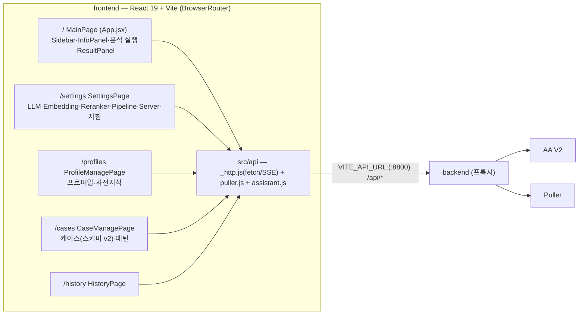

# frontend 기술 설계서

| 항목 | 값 |
| --- | --- |
| 작성일 | 2026-07-15 |
| **기준 커밋** | `3fc6fc4a65735e5c86fdfc94ddf0f5981a7fe2e3` (`3fc6fc4`, branch `docs-technical-writing-guide`) |
| 대상 | `frontend/` 디렉토리 전체 (src 약 4,700 라인 JS/JSX + App.css 3,185 라인) |
| 작성 기준 | [기술 문서 작성 가이드](./기술%20문서%20작성%20가이드.md) |
| 관련 문서 | [backend 기술 설계서](./backend%20기술%20설계서.md) · [AnalyzingAssistant_V2 기술 설계서](./AnalyzingAssistant_V2%20기술%20설계서.md) |

> 이 문서는 위 커밋 시점의 코드를 근거로 작성된 as-built 설계서이다.
> 이후 수정사항은 본 문서의 기준 커밋과 diff 하여 반영한다.

---

## 0. 목표 및 범위

frontend는 LogAA의 **React SPA(Single Page Application)**로, backend(`:8800`)의 `/api/*`를 유일한 데이터 소스로 사용한다. 사용자 여정: **defect 가져오기 → 로그 분석 실행(SSE 진행률) → 리포트 열람 → 지식 자산(케이스·패턴·프로파일·사전지식)·설정·이력 관리**.

- **범위 안**: `frontend/` 전체 — 진입(`index.html`, `main.jsx`), 라우팅(`App.jsx`), API 계층(`src/api/`), 페이지·컴포넌트(`src/components/`), 스타일(`App.css`, `index.css`), 빌드 설정(`vite.config.js`, `package.json`, `.env`).
- **범위 밖**: backend·AA V2 내부(각 설계서 참조). 본 문서는 이들을 계약 소비자 관점으로만 다룬다.

## 1. 시스템 요구사항·제약 (코드 관찰 기반)

| # | 요구사항 / 제약 | 근거 (확신도) |
| --- | --- | --- |
| R1 | Puller에서 defect를 가져오고(자격증명 선택 입력, 기존 데이터 재사용 확인 모달), 최근 목록에서 선택할 수 있다 | `Sidebar.jsx`, `DefectExistsModal.jsx` (high) |
| R2 | 선택 defect에 대해 분석을 제출하고 SSE로 진행률·완료·오류·취소를 실시간 반영한다 | `App.jsx`, `api/assistant.js subscribeAnalysis` (high) |
| R3 | 분석 대상 파일을 3분류(기본/댓글 첨부/사용자 추가)에서 선택하고, 서버 경로로 사용자 로그를 추가할 수 있다. 로그가 0건이면 분석 대신 안내 모달을 띄운다 | `AnalyzeSettingsModal.jsx`, `NoLogsModal.jsx`, `App.jsx hasLogs` (high) |
| R4 | 리포트는 Markdown 렌더링 + 클립보드 복사 + `.md` 다운로드를 지원하고, 매칭 케이스에 현재 defect를 외부 참조로 등록/해제할 수 있다 | `ResultPanel.jsx` (high) |
| R5 | MoE 앙상블 결과(선정 프로파일, 기타 후보 케이스 표)와 경고를 표시한다 | `ResultPanel.jsx MinorityReportSection` (high) |
| R6 | 케이스 리포트 스키마 v2 입력 폼(섹션 01~05+SYS)을 제공하고, AA와 동일한 조건부 필수 규칙을 클라이언트에서 선검증한다 | `CaseManagePage.jsx validateReport` — 최종 방어선은 AA 422 (high) |
| R7 | 패턴(5타입)·프로파일·사전지식·LLM/Embedding/Reranker/파이프라인/서버 설정·분석 이력을 관리 UI로 제공한다 | `CaseManagePage`·`ProfileManagePage`·`SettingsPage`·`HistoryPage` (high) |
| C1 | backend 주소는 빌드타임 상수(`VITE_API_URL`, `.env` 커밋됨) — 프록시 없이 브라우저가 직접 fetch (CORS 의존) | `api/_http.js`, `.env` (high) |
| C2 | 인증 헤더 없음 — backend 무인증 전제(backend 설계서 §9-2)와 짝을 이룸. `EventSource`는 커스텀 헤더 불가이므로 이 전제가 SSE에도 필요 | `_http.js`, `subscribeAnalysis` (high) |
| C3 | 상태 관리 라이브러리 없음 — 컴포넌트 로컬 상태 + prop 전달, 페이지 간 공유는 없음 | 전 컴포넌트 (high) |

## 2. 아키텍처 개요

**얇은 API 계층 위의 페이지 단위 SPA**다. 전역 스토어 없이 각 페이지가 자기 데이터를 직접 fetch하고, 유일한 횡단 계층은 `src/api/`(fetch 래퍼 + 엔드포인트 함수 ~60개)다. 라우팅은 react-router 5개 경로이며, 관리 페이지들은 메인과 상태를 공유하지 않는 독립 화면이다.

스타일은 단일 `App.css`(Light Warm Theme) — CSS 변수 기반 디자인 토큰과 도메인 접두 클래스(`pm-*` 관리 폼, `cr-*` 케이스 리포트, `hist-*` 이력, `as-*` 분석 설정 모달)로 구성된다. 케이스 스키마 v2 UI는 `Document/로그분석 리포트 및 케이스 스키마 개선/style/` 핸드오프를 기존 테마와 통합한 결과다.

## 3. 컴포넌트 설계

### 3.1 API 계층 (`src/api/`)

| 모듈 | 책임 |
| --- | --- |
| `_http.js` | `BASE_URL = import.meta.env.VITE_API_URL`. `_request(method, path, body)` — JSON fetch, 실패 시 응답의 `detail`을 `Error.message`로 승격(backend가 전파한 AA 오류 메시지가 그대로 UI에 도달). `_sseUrl(path)` — SSE URL 조립 |
| `puller.js` | Puller 관련 4함수 (`getPullers`/`getDefects`/`getDefect`/`fetchDefect`) |
| `assistant.js` | backend `/api/*` 전체를 1:1 미러링한 함수 집합: 분석(제출/폴링/취소/SSE 구독), 파일·사용자 로그, 프로파일·사전지식, 설정 6그룹, 케이스·패턴·참조, 이력. `subscribeAnalysis`는 `EventSource`로 `progress`/`done`/`cancelled`/`error` 이벤트를 콜백에 매핑하고 해지 함수를 반환 |
| `index.js` | 두 모듈 re-export (단일 import 지점) |

### 3.2 메인 화면 (`App.jsx` MainPage + 하위)

| 컴포넌트 | 책임 |
| --- | --- |
| `App.jsx` | 라우트 5개 정의. `MainPage`가 화면 상태의 소유자: `selectedCase`(sessionStorage `logaa_selectedCase` 영속), `selectedProfiles`, `selectedFiles`(null=전체), `analysisState`(idle/running/done/error), SSE 구독 ref 관리(케이스 변경·언마운트 시 해지), 로그 0건 시 NoLogsModal 분기 |
| `Sidebar.jsx` | Puller 선택 + Defect ID + 자격증명(선택) 입력 → 가져오기. 기존 데이터 존재 시 `DefectExistsModal`(재사용/다시 가져오기). 최근 20건 목록 upsert·선택 |
| `InfoPanel.jsx` | 선택 defect 요약: 제목·SW Version·칩 배지·설명·첨부파일·댓글(첨부 있는 것만, 날짜/작성자/본문 파싱)·사용자 추가 로그 |
| `ProfileSelector.jsx` | 분석 프로파일 다중 선택 토글 + 선택 프로파일의 사전정제 키워드 합집합 미리보기 |
| `AnalyzeHeader.jsx` | 분석 시작/취소 버튼 + 관리 화면 이동 버튼 4종. 로그 없음 상태는 비활성처럼 보이되 클릭 시 안내 모달 |
| `AnalyzeSettingsModal.jsx` | 분석 고급 설정: 서버 경로로 사용자 로그 추가/삭제, 분석 대상 파일 3분류 체크박스(전체=null 규약, 전체 선택 시 null 복귀) |
| `ProgressPanel.jsx` | 진행률 바(%·stage 설명) + 접이식 상세 스테이지 목록(하드코딩 6단계 — §9-1) |
| `ResultPanel.jsx` | verdict 아이콘/점수, 매칭 케이스·칩 배지, `DefectReferenceControl`(현재 defect를 케이스 참조로 등록/제거 — system명 `"Kona"` 상수), 선정 프로파일, 매칭 패턴, ReactMarkdown 리포트(복사/다운로드), 경고 목록, `MinorityReportSection`(기타 후보 표 — ensemble/first_hit 모드면 빈 상태도 표기) |
| `CardWindow.jsx` | 공용 카드 프레임: 타이틀 클릭 접기, ⤢ 버튼으로 포털 기반 전체화면 확대(Esc 닫기). 결과 카드의 "완료 시 자동 크게 보기"(localStorage `result-auto-expand`)와 연동 |
| `ErrorPanel.jsx` / `NoLogsModal.jsx` / `DefectExistsModal.jsx` | Puller 오류 표시 / 로그 없음 안내 / 기존 defect 재사용 확인 |

### 3.3 관리 페이지

| 페이지 | 책임 |
| --- | --- |
| `CaseManagePage.jsx` (1,884줄) | 케이스/패턴 2탭. **케이스 탭**: 목록(이름 검색 + 프로파일 필터, verdict·상태 뱃지), 생성 폼·상세 모달(읽기 요약 ↔ 수정 폼 전환). `CaseForm`은 스키마 v2 섹션 01(기본 정보, 담당 모듈은 profile_refs 첫 값 prefill)·02(현상/분석)·03(판정 — 결함/비결함/판정불가 라디오, 결함영역 ExpandCard, 판정불가 사유 라디오)·04(조치 4종 체크카드 — fix 반복 리스트 편집기 포함)·05(비고)·SYS(키워드·칩 태그 선택기·profile refs·패턴 연결). `validateReport`가 AA §2.2 규칙을 미러링해 저장 전 검증, 판정과 무관한 잔존 필드는 전송 전 정리. `caseStatus`로 열린/닫힌/레거시 파생. 외부 참조는 저장 후 인라인 편집(`ReferencesSection`, 클립보드 복사). ChromaDB 전체 동기화 버튼. **패턴 탭**: 5타입별 동적 필드 폼(COMPOSITE 구성 패턴 토글), 타입 필터, 상세 모달, 삭제 시 연쇄 삭제된 COMPOSITE 알림 |
| `ProfileManagePage.jsx` | 프로파일/사전지식 2탭. dirty 추적 + 이탈 확인(`window.confirm`). 프로파일: 지침·카테고리·사전정제 키워드·사전지식 참조(검색 토글). 사전지식: store_type(sqlite/chromadb) 선택, 카테고리·서브카테고리·칩 태그 |
| `SettingsPage.jsx` | AA 설정 6섹션: LLM/Embedding `ModelSection`(공용 훅 `useModelSection` — 프로필 선택→설정 로드→모델 목록 조회→연결 확인→저장, 고급 옵션: provider/max_tokens/timeout/temperature), Reranker(1차+fallback 프로필), Pipeline(임계값 슬라이더, unknown_refine_mode·chip_match_mode·context_strategy 선택, num_ctx 조회 시 권장 max_log_lines 자동 반영, Stage6·Observability 토글), Server(max_workers — 재시작 후 적용 안내), 시스템 분석 지침(기본값 초기화 지원) |
| `HistoryPage.jsx` | 이력 목록(limit 20~500 선택, defect_id 클라이언트 필터), 행 삭제, 전체/필터 삭제(필터 시 개별 DELETE 병렬 반복), 상세 모달(메타·문제 설명·매칭 패턴·리포트 접이식 전문·Stage 로그 이름/시각 목록) |

## 4. 인터페이스 / 계약 (소비자 관점)

- **REST**: backend 설계서 §4.1의 전 엔드포인트를 `assistant.js`/`puller.js` 함수로 소비. 오류 계약: `{detail}` JSON → `Error.message` (계약 위반 시 일반 메시지 `"METHOD path 실패"`).
- **SSE**: `GET /api/defect/analyze/{job_id}/stream`의 이벤트 4종을 구독. `error` 이벤트는 payload 유무로 "분석 오류"와 "연결 오류"를 구분. 종결 이벤트(done/error/cancelled) 수신 시 `es.close()`.
- **분석 결과 형태**(AA `_serialize_result` 산출물): `verdict`("문제"/"불확실"/"알 수 없음" — 아이콘·클래스 매핑 상수 보유), `report_md`, `matched_case{case_id,name,chip_tags,references,…}`, `match_result{score,matched[],unmatched[]}`, `minority_reports[]`, `winner_profile_names`, `warnings`, `traversal_mode`.
- **케이스 스키마 v2**: `CaseSaveRequest` 필드 전체를 폼이 구성. enum 토큰↔한국어 라벨 매핑 상수(`VERDICT_LABEL`, `AREA_TYPE_LABEL`, `REASON_OPTIONS`, 조치 항목들)는 분류 체계 v2.0 문서 기준. "기타" 항목은 `other:<서술>` 토큰 규약.

## 5. 상태·데이터 모델

- **전역 상태 없음** (C3). 서버 상태는 페이지 마운트 시 fetch, 변이 후 재로드(reload 패턴).
- **브라우저 영속**: sessionStorage `logaa_selectedCase`(새로고침 시 선택 defect 유지), localStorage `result-auto-expand`. 선택 프로파일·파일 목록은 비영속(새로고침 시 초기화).
- **빌드 설정**: `.env`의 `VITE_API_URL`(커밋됨 — 배포 환경별 빌드 필요), `vite.config.js`는 react 플러그인만(프록시 미사용). 의존성 4개: react/react-dom 19, react-router-dom 7, react-markdown 9.
- **구동**: `run_frontend.sh` = `npm run dev -- --host 0.0.0.0` (Vite dev 서버, §9-5).

## 6. 데이터 & 제어 흐름 — 분석 시나리오 E2E

1. **가져오기**: Sidebar에서 Puller·Defect ID(±자격증명) 입력 → `getDefect`로 기존 여부 확인 → 있으면 재사용/재수집 모달 → `fetchDefect` → 목록 upsert + 선택.
2. **선택**: `selectedCase` 변경 시 SSE 해지·분석 상태 초기화·파일 선택 초기화, `getDefectFiles`로 로그 존재 확인(`hasLogs`).
3. **실행**: `submitAnalysis(defect_id, {profile_names, selected_files?})` → `job_id` → `subscribeAnalysis` SSE 구독. progress 이벤트가 진행률 바·stage 텍스트를 갱신, 취소 버튼은 `cancelAnalysis` 후 즉시 idle 복귀.
4. **결과**: done 이벤트의 `result`로 ResultPanel 렌더 — 자동 확대 옵션 시 결과 카드를 전체화면으로. defect 참조 등록 시 `addKBCaseReference` 후 신선한 참조 목록을 상위 상태(`analysisState.report`)에 역전파(`onReportUpdate`).
5. **지식 자산 편집**: 케이스 저장은 `create/updateKBCase` 후 패턴 연결 diff를 `link/unlinkKBCasePattern` 반복 호출로 반영(비원자적 — §9-6).

## 7. 기술 선택

| 선택 | 근거 |
| --- | --- |
| React 19 + Vite, 추가 프레임워크 없음 | 소규모 내부 도구 — 페이지 5개, 전역 상태 요구 없음. 상태 라이브러리·데이터 fetch 라이브러리 없이 로컬 상태 + reload 패턴으로 충분 |
| `EventSource` 기반 SSE | 분석 진행률의 단방향 스트림에 WebSocket 불필요. backend가 무인증이므로 헤더 제약도 문제 없음 (C2) |
| `react-markdown` | LLM 산출 리포트(신뢰 경계 내부)의 안전한 렌더링 — dangerouslySetInnerHTML 회피 |
| 단일 `App.css` + CSS 변수 + 도메인 접두 클래스 | CSS-in-JS 없이 테마 일관성 유지. 스키마 v2 UI(`cr-*`)도 기존 토큰 위에 통합 |
| 클라이언트 선검증(`validateReport`) | 422 왕복 전에 즉각 피드백 — 규칙의 원본은 AA, 프론트는 UX용 미러 (대가: §9-2) |
| 파일 선택의 `null=전체` 규약 | "전체"가 기본이자 최빈 케이스 — 파일 목록 변화(사용자 로그 추가)에도 전체 선택이 자동 추종 |

## 8. 트레이드오프 & 대안

| 결정 | 채택 이유 / 대가 |
| --- | --- |
| 전역 스토어 없이 prop 전달 + 페이지별 독립 fetch | 단순성 우선. 대가: 관리 페이지에서 돌아와도 메인 상태는 sessionStorage에 저장한 selectedCase만 복원 — 분석 결과는 유지되나 새로고침 시 소실 |
| SSE 구독을 ref로 관리하고 케이스 전환 시 즉시 해지 | 이전 job의 이벤트가 새 화면을 오염시키지 않음. 대가: 화면 이탈 후 재진입 시 진행 중 job 재구독 불가(폴링 API `pollAnalysis`는 존재하나 미사용) |
| defect 참조 등록 후 참조 목록을 report 상태에 역전파 | 재분석 없이 등록 상태 UI 일관성 유지. 실패는 무시(로컬 상태로 동작) |
| 이력 defect 필터를 클라이언트에서 수행 | backend에 defect_id 쿼리가 있으나 목록을 이미 들고 있어 왕복 절약. 대가: limit 범위 밖 이력은 필터에 안 보임 |
| `window.confirm`/`alert` 기반 파괴 작업 확인 | 모달 구현 비용 절약. 대가: 스타일 불일치, 브라우저 다이얼로그 |

## 9. 위험 & 미해결 질문

| # | 항목 | 내용 (확신도) |
| --- | --- | --- |
| 1 | ProgressPanel 상세 스테이지가 실제와 불일치 | 하드코딩 6단계("키워드 필터링·벡터 검색·재랭킹·프롬프트 조립" 등)가 AA notify 명칭("Stage N — …", "마스터 룰", "Fallback", "Reflection")과 매칭 실패 — `stage.split(" — ")[0]`(="Stage 1" 등)에서 라벨을 찾으므로 항상 -1 → 상세 보기가 늘 1단계 진행 중으로 표시. 요약 진행률 바는 정상. **알려진 버그**(2026-07-15 사용자 확인) (high) |
| 2 | 검증 규칙 삼중 유지보수 | 케이스 v2 조건부 필수 규칙이 frontend `validateReport` ↔ backend 프록시 모델 ↔ AA `model_validator` 세 곳에 존재 — 규칙 변경 시 3곳 동기화 필요 (high) |
| 3 | `DEFECT_SYSTEM = "Kona"` 하드코딩 | defect 참조 등록의 시스템명이 ResultPanel 상수. 단순 설정화 문제가 아니라 **defect 시스템 의존성 때문에 frontend 자체를 defect 시스템별로 분리 운영하는 방향까지 포함해 추후 검토**할 사항(2026-07-15 사용자 의견). 현재는 다른 defect 시스템 추가 계획 없음 (high) |
| 4 | CDN 폰트 의존 | `index.html`이 jsdelivr에서 Pretendard·JetBrains Mono 로드 — 인터넷 차단 사내망에서는 폰트 폴백으로 동작(기능 영향 없음, 시각 저하) (high) |
| 5 | 운영 구동이 Vite dev 서버 | `run_frontend.sh`가 `npm run dev` — 프로덕션 빌드(`vite build`)·정적 서빙 절차 미정의 (high) |
| 6 | 케이스 저장 + 패턴 연결 비원자성 | create/update 후 link/unlink를 개별 호출 — 중간 실패 시 케이스는 저장되고 연결만 누락된 부분 상태 가능 (medium) |
| 7 | ~~`is_required` UI 노출~~ → **해소** | 2026-07-16 해소 — 기능 자체를 미도입으로 확정(AA §9-1)함에 따라 패턴 폼 "필수" 체크박스·⭐필수 배지(상세·연결 목록) 제거 |
| 8 | `.env` 커밋 | `VITE_API_URL`이 저장소 고정 — 환경별 배포 시 재빌드·수정 필요, 비밀은 아님 (medium) |

## 10. 확정 이력

| 일자 | 내용 |
| --- | --- |
| 2026-07-15 | 최초 작성. 기준 커밋 `3fc6fc4` (as-built, 코드 전수 탐독 기반) |
| 2026-07-15 | 사용자 리뷰: §9 위험 항목 1~8 **전부 유지** 확정 — 1번은 알려진 버그로 확인, 3번에 defect 시스템별 frontend 분리 운영 검토 관점 추가(현재 타 defect 시스템 추가 계획 없음), 4·5번은 추후 확인/검토 예정 |
| 2026-07-16 | §9-7 해소 — is_required 기능 미도입 확정(AA §9-1)에 따라 관련 UI 제거 |
