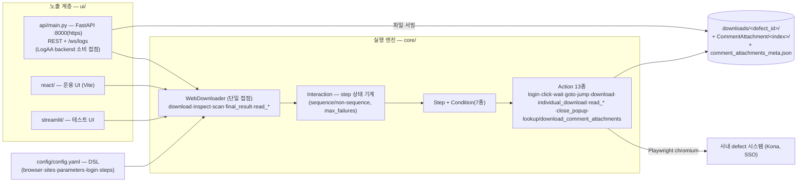

# puller 기술 설계서

| 항목 | 값 |
| --- | --- |
| 작성일 | 2026-07-16 |
| **기준 커밋** | `a745073` (branch `docs-technical-writing-guide`) |
| 대상 | `puller/` 디렉토리 전체 (core 약 2,400 라인 + ui/api 619 라인 + react/streamlit UI) |
| 작성 기준 | [기술 문서 작성 가이드](./기술%20문서%20작성%20가이드.md) |
| 관련 문서 | [backend 기술 설계서](./backend%20기술%20설계서.md)(소비자) · [LogAA 시스템 기술 설계서](./LogAA%20시스템%20기술%20설계서.md) |

> 이 문서는 위 커밋 시점의 코드를 근거로 작성된 as-built 설계서이다.
> 이후 수정사항은 본 문서의 기준 커밋과 diff 하여 반영한다.

---

## 0. 목표 및 범위

puller는 **사내 defect 관리 시스템(현재 Kona)의 웹 UI를 Playwright로 자동 조작해 defect 본문 텍스트·첨부파일·댓글 첨부를 수집하는 선언적 웹 자동화 수집기**다. 자동화 플로우는 코드가 아닌 `config/config.yaml`의 DSL로 정의되며, REST API(FastAPI)로 노출되어 LogAA backend가 소비한다(시스템 설계서 §4.3의 공급자 측).

- **범위 안**: `puller/core/`(자동화 엔진), `puller/config/config.yaml`(DSL·사이트 정의), `puller/ui/api/`(REST + WebSocket 서버 — LogAA 연동 접점), `puller/ui/react/`·`puller/ui/streamlit/`(단독 운용/테스트 UI).
- **범위 밖**: 대상 사이트(Kona) 자체, LogAA backend의 소비 로직(backend 설계서 §4.3).

## 1. 시스템 요구사항·제약 (코드 관찰 기반)

| # | 요구사항 / 제약 | 근거 (확신도) |
| --- | --- | --- |
| R1 | 사이트 자동화 플로우(로그인·이동·클릭·수집·다운로드)를 **YAML 선언만으로 정의**한다 — 사이트 변경 시 코드 배포 불필요 | `config.yaml` DSL 주석·`core/step.py`·`action.py` (high) |
| R2 | SSO 로그인 리다이렉트를 감지해 자동 로그인 후 원래 페이지로 복귀한다 (non-sequence 예외 step) | `login.py`, config `Log in` step (high) |
| R3 | defect ID를 URL 파라미터로 조립해 상세 페이지에 진입하고, 제목·SW_Version·설명·재현조건 텍스트를 수집한다 | `url_builder.py`, config `Kona Defect Window` step (high) |
| R4 | 첨부파일을 3방식(일괄 이벤트 수집 / 체크박스 개별 순회 / 브라우저 직접 저장)으로 다운로드하고, 댓글 첨부는 메타 파일 기반으로 **미완료 항목만 재시도**한다 | `action.py` Download·IndividualDownload·DownloadCommentAttachments (high) |
| R5 | 실행을 REST로 노출한다: 동기(`/api/final`)와 비동기 job(`/api/final/start`+폴링), 수집 파일 서빙, WebSocket 실시간 로그 | `ui/api/main.py` (high) |
| R6 | 자격증명은 요청 body(`credentials`) 우선, 없으면 `.env`(사이트별 env 키) — 서버에 영속 저장하지 않음 | `login.py` (high) |
| C1 | HTTPS 사설 인증서(`puller/certs/server.{key,crt}`)로 서빙 — 저장소에 미포함, 배포 시 배치 필요 (backend §9-10과 동일 계열) | `main.py __main__` (high) |
| C2 | 브라우저 자동화 특성상 데스크톱급 호스트 전제 — Windows 대응 코드(ProactorEventLoop)와 Windows 경로의 `chromium_path`가 기본값 | `main.py`, `config.yaml` browser (high) |
| C3 | UI↔Core 단일 접점: UI 3종은 `WebDownloader`만 알고, Core는 UI를 모른다 | `downloader.py` 헤더 (high) |

## 2. 아키텍처 개요

**선언(DSL) / 실행 엔진(core) / 노출(ui) 3층 구조**다. 엔진은 실행마다 Playwright chromium을 새로 띄우고(상태 없음), 자동화 흐름은 config.yaml의 step 그래프를 해석하는 상태 기계(`Interaction`)가 수행한다.



기동: `python ui/api/main.py` — `__main__` 블록이 사설 인증서로 https :8000을 연다 (docstring의 `uvicorn main:app` 명령은 http라서 backend의 https 기대와 불일치 — §9-8).

## 3. 컴포넌트 설계

### 3.1 core/ — 자동화 엔진

| 컴포넌트 | 책임 |
| --- | --- |
| `downloader.py` `WebDownloader` | UI와의 단일 접점. 브라우저 기동(헤드리스·사설 인증서 무시·다운로드 경로), 실행 모드 7종: `download`/`inspect`(최종 페이지 상태)/`scan`(전 프레임의 input·button·link·table·clickable 셀렉터 자동 발굴 — config 작성 보조)/`final_result`(통합: 파일+텍스트+테이블+댓글첨부)/`read_text`/`read_table`/`lookup_comment_attachment`. 다운로드 저장 경로는 `download_dir/<첫 번째 param 값(=defect ID)>/` |
| `interaction.py` `Interaction` | step 상태 기계: entry step → condition 체크 → actions 실행 → expect 체크 → 충족 시 next_step(단일 또는 조건 분기 `next_steps`), 미충족 시 failure_count 증가 후 **non-sequence step**(예외 처리기 — 로그인 페이지·메인 리다이렉트 등) 중 조건 매칭되는 것을 실행하고 `jump`로 복귀. `max_iterations`(10)·`max_failures`(3) 가드 |
| `step.py` `Step`/`Condition` | step 정의(sequence/non-sequence, final, next_step(s), actions)와 조건 7종(domain_is/url_contains/url_matches/url_equals/selector_exists/selector_not_exists/title_contains, and/or 복수 조건). 조건 값의 `{파라미터}` 치환 지원 |
| `action.py` Action 13종 | login, click(js_click·`expect_popup` 팝업 전환), wait, goto(`"site"`=원 URL), jump, close_popup, download(일괄/`wait_after` 다중 이벤트/`no_intercept` 직접 저장), individual_download(테이블 체크박스 순회 — 체크→다운로드→해제, 파일별 성공/실패 기록), read_title/read_text/read_table(행·열 범위, iframe 대응), lookup_comment_attachment(댓글 ul>li 순회 — 첨부 iframe URL 수집 + 메타 저장), download_comment_attachments(메타 기반 미완료 재시도). **결과는 `site_config`에 `_file_results` 등 언더스코어 키로 기록**하고 WebDownloader가 회수(§8) |
| `login.py` | 자격증명 주입(요청 body > `.env`), 로그인 후 `wait_for_url_stable`(URL 변화 정지 감지)로 리다이렉트 완료 대기 |
| `url_builder.py` | `parameters` 선언("UI명:쿼리키[=고정값]" 3형식)과 UI 입력값을 병합해 최종 URL 조립, UI 입력 필요 파라미터 목록 제공 |
| `result.py` | UI에 전달되는 결과 dataclass 7종(FileResult/DownloadResult/InspectResult/ScanResult/TableData/ReadText·ReadTableResult/FinalResult) |
| `config.py` | `config.yaml` 로더 (경로 지정 가능) |

### 3.2 ui/ — 노출 계층

| 컴포넌트 | 책임 |
| --- | --- |
| `ui/api/main.py` | FastAPI 서버(§4). in-memory job 저장소(dict — 완료 결과는 **1회 조회 후 삭제**), `LogBroadcaster`+`PrintCapture`로 **stdout 전역 후킹** → `/ws/logs` WebSocket 브로드캐스트, 수집 파일 서빙(FileResponse). CORS 전면 허용, 인증 없음 |
| `ui/react/` | 단독 운용 UI(Vite): 사이트 선택→파라미터/자격증명 입력→step 선택 실행→실시간 로그(WebSocket)·결과 뷰. `BASE_URL`이 `http://localhost:8000` 하드코딩. `ui/react/components/`(구버전, `PramaInput` 오타 포함)와 `ui/react/src/components/` **이중 구조 — 전자는 잔재** (§9-6) |
| `ui/streamlit/app.py` | 테스트용 UI(주석 명시 "임시 테스트용") — Core를 직접 호출 |

## 4. 인터페이스 / 계약

### 4.1 REST API (`:8000` https, 무인증)

| 그룹 | 엔드포인트 | 내용 |
| --- | --- | --- |
| 설정 | `GET /api/config` | 사이트 목록·UI 입력 파라미터·step 목록 (UI 구성용) |
| 실행(동기) | `POST /api/final` · `/api/download` · `/api/read_text` · `/api/read_table` · `/api/inspect` · `/api/scan` · `/api/lookup_comment_attachment` · `/api/download_comment_attachments` | body는 공통 `SiteRequest{site_name, until_step_name?, param_values{}, credentials?}`. 응답 `{success, data, error}` — HTTP는 항상 200, 실패는 body로 표현 |
| 실행(비동기) | `POST /api/final/start` → `{job_id}` · `GET /api/job/{job_id}` | job은 in-memory, 상태 `running/done/error`. **done/error 응답은 1회 조회 후 삭제**(단일 소비자 전제) |
| 파일 서빙 | `GET /api/files/{defect_id}[/{filename}]` · `GET /api/comment_attachments/{defect_id}[/{index}/{filename}]` | downloads 디렉토리 목록/스트림 전송. 댓글 첨부 목록은 메타 파일 기반 |
| 로그 | `WS /ws/logs` | 서버 stdout 실시간 브로드캐스트 |

### 4.2 LogAA backend가 소비하는 부분집합

`/api/final`(동기, async_fetch=false) 또는 `/api/final/start`+`/api/job/{id}`(2초 폴링) · `/api/files/*` · `/api/comment_attachments/*`. `data.texts`의 `SW_Version` 키가 backend의 칩 해석 입력이 되고, `data.title`·`texts` 전체가 meta.json의 `title`·`description`이 된다 — **config.yaml의 read_text `name` 선언이 곧 시스템 계약** (SW_Version 키 이름 변경은 backend 칩 해석을 깨뜨린다).

### 4.3 config.yaml DSL (선언 계약)

- `browser`: chromium_path(선택)·headless·ignore_https_errors.
- `sites[]`: name(=API의 site_name 키), url, `parameters`(UI명↔쿼리키 매핑), login(셀렉터·env 키), download_dir, `interactions{max_iterations, max_failures, entry_step, steps[]}`.
- step: `type`(sequence=메인 플로우 / non-sequence=조건 매칭형 예외 처리기), `condition`/`conditions`(7종, `{param}` 치환), `actions[]`(13종), `expect`(성공 판정), `next_step`/`next_steps`(조건 분기), `final`.
- 현재 등록 사이트 1건: "Pulling PLM description and attached files" — Kona defect 페이지 (SSO `sts.secsso.net` 로그인 non-sequence, PLM Attachment 유무 분기, 개별 다운로드, 댓글 첨부 수집).

## 5. 데이터 모델

### 5.1 downloads 디렉토리 (puller 자체 저장소)

```text
downloads/<defect_id>/
├── <PLM 첨부파일들>                     # individual_download 결과
└── CommentAttachment/
    ├── comment_attachments_meta.json   # 댓글별 첨부 URL·downloaded/error 상태 (재시도 기준)
    └── <index>/<첨부파일들>             # 댓글 순번별 첨부
```

이 저장소는 **중간 캐시**다 — LogAA backend가 `/api/files`·`/api/comment_attachments`로 받아 자신의 `workspace/`에 복사하므로 시스템 관점에서는 이중 저장이 된다(§8).

### 5.2 실행 결과 전달 규약 (내부)

Action → WebDownloader 간 결과 전달은 `site_config` dict의 언더스코어 키 부수효과로 이뤄진다: `_file_results`, `_text_results`, `_table_results`, `_comment_attachment_items`, `_title`, `_jump_to`, `_parent_page`, `_param_values`, `_credentials`. WebDownloader가 `pop()`으로 회수해 Result dataclass로 변환한다.

## 6. 데이터 & 제어 흐름

### 6.1 통합 수집 실행 (`/api/final` 기준)

1. `site_name`으로 config에서 사이트 선택 → `build_url`로 defect ID 반영 URL 조립 → `WebDownloader` 생성(다운로드 하위 폴더 = defect ID).
2. Playwright chromium 기동 → 대상 URL 진입 → `Interaction.run()`:
   - Kona 시나리오: `Entry`(URL에 defect ID 확인) → SSO 리다이렉트 감지 시 non-sequence `Log in`(자격증명 입력 → 원 URL 복귀) → `Kona Defect Window`(제목·SW_Version·PLMID·설명·재현조건 read) → PLM Attachment 유무로 분기(첨부 팝업 → 개별 다운로드 / 없으면 댓글 첨부로) → 댓글 첨부 lookup·download → final.
   - 각 step 실패는 failure_count로 집계, non-sequence 처리기·`jump`로 복구, `max_failures`/`max_iterations` 초과 시 전체 실패.
3. 결과 회수(§5.2) → `FinalResult` → JSON 직렬화 응답. 비동기 경로는 동일 실행을 BackgroundTask로 돌리고 job dict에 기록.

### 6.2 LogAA 통합 관점

backend `POST /api/defect/fetch` → puller 비동기 실행(2초 폴링) → 완료 후 backend가 파일 목록·댓글 첨부를 HTTP로 내려받아 workspace 구성 → 이후 분석 파이프라인은 puller와 무관(backend 설계서 §6.1). puller는 **수집 시점에만 관여하는 stateless 공급자**다.

## 7. 기술 선택

| 선택 | 근거 |
| --- | --- |
| Playwright(async, chromium) 웹 자동화 | 대상 시스템에 공식 API가 없어 웹 UI 경유가 유일한 수집 경로. SSO·iframe·팝업·동적 로딩을 브라우저 수준에서 처리 |
| YAML DSL + 상태 기계 실행기 | 사이트 개편·신규 사이트를 config 수정만으로 대응 (R1). non-sequence step 패턴으로 "언제든 끼어드는" 로그인/리다이렉트를 메인 플로우와 분리 |
| `scan` 모드(셀렉터 자동 발굴) | DSL 작성의 가장 큰 비용인 셀렉터 찾기를 도구화 — 전 프레임의 입력/버튼/링크/테이블 후보를 덤프 |
| in-memory job + BackgroundTasks | 동시 수집이 사실상 1건(backend 단일 소비자)인 규모에서 브로커·DB 불요. 대가: §9-3 |
| 메타 파일 기반 댓글 첨부 재시도 | 첨부가 많고 개별 실패가 흔한 작업의 멱등 재실행 — 완료 항목 스킵 |
| stdout 후킹 → WebSocket 로그 | 엔진 전체가 print 기반이므로 코드 수정 없이 실시간 UI 로그 확보. 대가: §9-2 |

## 8. 트레이드오프 & 대안

| 결정 | 채택 이유 / 대가 |
| --- | --- |
| Action 간 통신을 `site_config` 부수효과로 | 반환 타입 통일(`(bool, Page)`) 유지하며 임의 결과 전달. 대가: 암묵 계약(언더스코어 키) — 새 Action 작성 시 문서화되지 않은 규약 의존 (§5.2에 명문화) |
| 실행마다 브라우저 신규 기동 | 세션 오염 없음·상태 없음. 대가: 실행당 수 초의 기동 비용 — 수집 빈도가 낮아 수용 |
| puller 자체 downloads 저장 + backend 재다운로드 | puller를 LogAA에 결합시키지 않는 독립 서브시스템으로 유지(자체 UI로 단독 운용 가능). 대가: 동일 파일 이중 저장·이중 전송 |
| 실패를 HTTP 200 + body `success:false`로 표현 | UI(react)의 단순 처리. 대가: backend는 `success` 필드를 별도 확인해야 함(실제로 확인함 — backend §6.1) |
| headless 기본 + `--window-position=-9999` | 서버 운용 시 창 숨김. 대가: 사이트의 봇 감지 정책 변화에 취약(현재 이슈 없음) |

## 9. 위험 & 미해결 질문

| # | 항목 | 내용 (확신도) |
| --- | --- | --- |
| 1 | 대상 사이트 변경 취약성 | Kona DOM/셀렉터/SSO 흐름 변경 시 수집이 조용히 실패 — config 수정으로 대응 가능하나 변경 감지·알림 수단 없음, 실패는 backend 502로만 드러남 (high) |
| 2 | stdout 전역 후킹의 부작용 | `PrintCapture`가 모든 프로세스 출력을 `asyncio.create_task`로 브로드캐스트 — 이벤트 루프 밖 print(기동 직후·스레드)에서 예외/로그 유실 가능, 서드파티 출력도 WebSocket에 노출 (medium) |
| 3 | in-memory job의 1회성 | 완료 결과가 첫 조회 후 삭제되고 재시작 시 전부 소실 — 단일 소비자(backend) 전제. 다중 클라이언트·재조회 요구 시 재설계 필요 (high) |
| 4 | 파일 서빙 경로 검증 부재 | `/api/files/{defect_id}/{filename}` 등이 경로 세그먼트를 그대로 join — 인코딩된 경로 조작(traversal) 가능성 검증 필요. 무인증(§9-7)과 결합 시 노출 면 확대 (medium — 실제 악용 가능 여부 미검증) |
| 5 | config.yaml의 민감 정보 커밋 | 실제 사내 URL(kona.sec.samsung.net)·SSO 도메인·셀렉터·개인 사용자명이 포함된 Windows 경로(chromium_path)가 저장소에 커밋됨 (high) |
| 6 | react UI 이중 구조 잔재 | `ui/react/components/`(구버전, `PramaInput` 오타)와 `ui/react/src/components/` 병존 — 전자 제거 여부 미결 (high) |
| 7 | 무인증 + CORS 전면 허용 | 자격증명(id/pw)을 body로 받는 실행 API가 무인증 — 신뢰 경계가 네트워크에 위임(시스템 설계서 §9-1과 동일 계열) (high) |
| 8 | 기동 절차 비공식 | 실행 방법이 `ui/api/Readme.md`의 "python main.py" 한 줄뿐. docstring의 uvicorn 명령은 http라 backend의 https 기대와 불일치, `requirements.txt`도 불완전(playwright·dotenv만 — fastapi/uvicorn/pyyaml/pandas 누락), `certs/` 미포함 (high) |
| 9 | 데스크톱/OS 전제 혼재 | Windows 전용 코드·경로가 기본값인 채 커밋 — 리눅스 서버 배포 시 config 수정 필요 사항이 문서화되지 않음 (medium) |

## 10. 확정 이력

| 일자 | 내용 |
| --- | --- |
| 2026-07-16 | 최초 작성. 기준 커밋 `a745073` (as-built — core·ui/api 전수, react/streamlit UI는 구조 수준 탐독) |
| 2026-07-16 | 사용자 리뷰: §9 위험 항목 1~9 **전부 유지** 확정 — 추후 검토 예정 |
