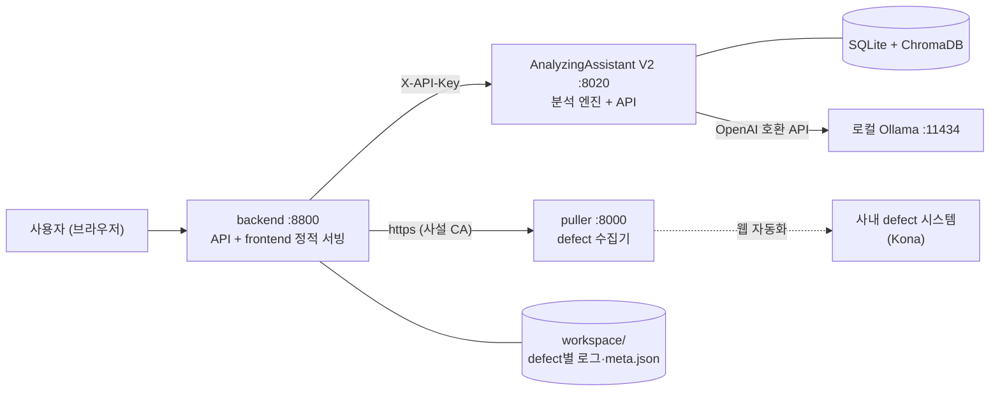

# LogAA — Log Analyzing Assistant

LogAA는 **사내 defect 관리 시스템의 문제(defect)를 가져와 리눅스 커널 로그를 자동 진단하고, 분석 결과를 지식 베이스(케이스·패턴)로 축적해 다음 진단의 정확도를 높이는** 로그 분석 어시스턴트 시스템이다.

> 본 문서는 시스템 개요와 개발 환경 구동 절차를 다룬다. 상세 설계는 [기술 설계 문서](#기술-설계-문서)를 참조한다.

---

## 시스템 구성

**4계층 파이프라인 아키텍처**: UI(SPA) → 오케스트레이션 프록시(BFF) → 분석 엔진, 그리고 엔진 뒤의 저장소·LLM.



| 서브시스템 | 역할 | 기술 |
| --- | --- | --- |
| `frontend/` | defect 선택 → 분석 실행(SSE 진행률) → 리포트 열람, 지식 자산(케이스·패턴·프로파일·사전지식)·설정·이력 관리 UI — 빌드 산출물을 backend가 서빙 | React 19 + Vite |
| `backend/` | Puller 수집·워크스페이스 관리·AA 중계의 얇은 async 프록시(BFF). 칩(chip) 해석 담당 | FastAPI + httpx |
| `AnalyzingAssistant_V2/` | 6-Stage 분석 파이프라인 + 지식 저장소 + job 서버 | FastAPI + ThreadPool, SQLite, ChromaDB, Ollama |
| `puller/` | defect 시스템 웹 자동화 수집기 — 자동화 플로우를 YAML DSL로 선언 | FastAPI + Playwright |

## 분석 파이프라인 요약

```text
Stage 1 정제(규칙 기반) → Master Rule 정규화 → Stage 2 KB 케이스 검색(임베딩 + LLM Reranker)
→ Stage 3/4 패턴 매칭(5타입, 규칙 기반) → Stage 5 리포트 생성(LLM) → Stage 6 자기검증(선택)
```

- **판정 3종**: `문제`(score ≥ 확정 임계값) / `불확실` / `알 수 없음` — evidence 로그 근거를 포함한 Markdown 리포트 산출.
- **지식 축적 루프**: "알 수 없음" 판정 → 사용자가 케이스(스키마 v2)·패턴 등록 → 즉시 다음 분석의 검색·매칭 대상에 편입. 케이스가 쌓일수록 자동 진단률이 올라간다.
- **MoE 앙상블**: 케이스 기반으로 분석 프로파일(전문가)을 라우팅해 병렬 검색 후 winner를 선정하는 모드 지원 (`moe_traversal_mode`).
- **칩 필터**: SW Version에서 해석한 칩 정보를 케이스·패턴·사전지식 매칭에 반영 (`chip_match_mode`: weight/filter).

## 저장소 구조

```text
LogAA/
├── frontend/                  # React SPA — 빌드 산출물(dist/)을 backend가 서빙
├── backend/                   # BFF 프록시 (config.yaml, workspace/, certs/)
├── AnalyzingAssistant_V2/     # 분석 엔진 (config/, db/, chroma_db/)
├── puller/                    # defect 수집기 (config/config.yaml DSL, certs/)
├── deploy/                    # systemd 서비스화 킷 (유닛 3종 + 가이드)
├── Document/                  # 기술 설계 문서·스펙
└── .venv/                     # 파이썬 공유 가상환경 (세 서버 공용)
```

---

## 개발 환경 설치 및 실행

### 전제 조건

- Python 3.11 이상, Node.js 18 이상 / npm 9 이상
- [Ollama](https://ollama.com) — LLM·임베딩·Reranker 모델 (`AnalyzingAssistant_V2/config/LLM/config.yaml` 프로필 기준)
- puller 구동 시: Playwright + chromium
- 사내망 프록시 환경: 내부 서버(127.0.0.1, Puller IP)에 대한 `no_proxy` 설정 필요 — `run_backend.sh`에 포함됨

### 테스트

```bash
pip install -r requirements-dev.txt   # pytest (운영 설치엔 불필요)
./run_tests.sh                        # backend/tests + AnalyzingAssistant_V2/tests
```

순수·경계 로직 대상(외부 의존·실제 DB 미접촉, 임시 DB·스텁 격리). 프로덕션 코드와 분리되어 있어 운영 구동에 영향 없다.

### 설치

```bash
# 파이썬 공유 가상환경 (저장소 루트)
python3 -m venv .venv
source .venv/bin/activate
pip install -r backend/requirements.txt
pip install -r AnalyzingAssistant_V2/requirements.txt
pip install -r puller/ui/api/requirements.txt   # puller 구동 시

# frontend
cd frontend && npm install
```

### 실행 (각각 별도 터미널)

| 순서 | 서버 | 명령 | 포트 |
| --- | --- | --- | --- |
| 1 | frontend 빌드 (1회) | `cd frontend && ./build_frontend.sh` | — (서버 아님) |
| 2 | AnalyzingAssistant V2 | `cd AnalyzingAssistant_V2 && ./run_aa.sh` | 8020 |
| 3 | puller | `cd puller/ui/api && python main.py` | 8000 (https) |
| 4 | backend | `cd backend && ./run_backend.sh` | 8800 |

접속: `http://<서버 IP>:8800` — backend가 frontend와 API를 함께 서빙 (API 문서: `/docs`)
프론트 수정 시 1번(빌드)만 다시 실행하면 된다. 개발 중 HMR은 `./run_frontend.sh`(dev 서버 :5173) 병행.

**상시 운영은 서비스화 권장** — systemd user 모드 유닛(sudo 불필요, 자동 재시작·기동 순서·journald 로그): [deploy/README.md](deploy/README.md) 참조.

### 필수 설정

| 파일 | 내용 |
| --- | --- |
| `backend/config.yaml` | Puller 목록(url·site_name·async_fetch), AA 목록(`active` 선택, url·api_key), workspace 경로, no_proxy, `allowed_client_ips`(접근 허용 IP/CIDR — 미설정 시 전체 허용) |
| `frontend/.env.development` | `VITE_API_URL` — dev 서버(`npm run dev`) 전용 backend 주소. 운영 빌드는 상대 경로라 설정 불필요 |
| `AnalyzingAssistant_V2/config/LLM/config.yaml` | LLM/Embedding/Reranker 프로필, 파이프라인 설정(임계값·MoE·컨텍스트 전략 등) — 대부분 설정 UI에서 변경 가능 |
| `AnalyzingAssistant_V2/config/api_keys.txt` 또는 env `LOGAA_API_KEY` | AA API 키 (backend `config.yaml`의 api_key와 일치해야 함) |
| `backend/config/sw_version_chip_map.yaml` | SW Version → 칩 매핑 (신규 칩 추가 지점) |
| `puller/config/config.yaml` | 수집 자동화 DSL — 사이트·로그인·step 정의 |

#### 인증서 (저장소 미포함, 수동 배치)

- `puller/certs/server.key`·`server.crt` — puller https 서빙용
- `backend/certs/server.crt` — backend가 puller를 신뢰하기 위한 CA. `config.yaml`의 `puller_client.ca_cert`로 경로 변경 가능하며, 공인 인증서·http Puller 환경에서는 설정을 제거하면 시스템 CA를 사용

### 동작 확인

1. 브라우저에서 frontend 접속 → Sidebar에서 Puller 선택, Defect ID 입력(필요 시 자격증명) → **가져오기**
2. 문제 정보(제목·설명·첨부파일·칩 배지)가 표시되면 수집 정상
3. 분석 프로파일 선택 → **분석 시작** → SSE 진행률 표시 후 리포트 출력되면 파이프라인 정상

## 데이터 위치

- defect 원본: `backend/workspace/<defect_id>/` (meta.json + 로그 파일, DB 없음 — 파일이 곧 상태)
- 지식 자산·분석 이력: `AnalyzingAssistant_V2/db/loganalyzer.db` (SQLite, 원본) + `AnalyzingAssistant_V2/chroma_db/` (파생 임베딩 인덱스, `POST /cases/sync`로 재구축 가능)
- 문제 목록은 최근 20건 표시, backend 재시작 후에도 유지

## 기술 설계 문서

as-built 설계서 — 기준 커밋과 diff하여 유지보수한다.

| 문서 | 대상 |
| --- | --- |
| [LogAA 시스템 기술 설계서](Document/Technical_Design/LogAA%20시스템%20기술%20설계서.md) | 시스템 수준 통합 관점 (아키텍처·계약·데이터 소유권·위험) |
| [frontend 기술 설계서](Document/Technical_Design/frontend%20기술%20설계서.md) | React SPA |
| [backend 기술 설계서](Document/Technical_Design/backend%20기술%20설계서.md) | BFF 프록시 |
| [AnalyzingAssistant_V2 기술 설계서](Document/Technical_Design/AnalyzingAssistant_V2%20기술%20설계서.md) | 분석 엔진·파이프라인·지식 저장소 |
| [puller 기술 설계서](Document/Technical_Design/puller%20기술%20설계서.md) | 웹 자동화 수집기·DSL |
| [기술 문서 작성 가이드](Document/Technical_Design/기술%20문서%20작성%20가이드.md) | 설계서 작성 기준 |

## 주의사항

- 인증은 backend↔AA 구간(X-API-Key)에만 존재한다. 사용자↔frontend↔backend 구간은 무인증 — 보안 경계는 사내망 접근 통제에 위임 (시스템 설계서 §9 참조).
- backend↔AA 간 로그 전달은 **서버 로컬 경로 공유**로 이루어진다 — 두 서버가 같은 파일시스템을 봐야 한다.
- 케이스 스키마 v2 필드·규칙 변경 시 AA `model_validator`(규범)와 frontend `validateReport`(UX 선검증) **2곳**을 수정한다 (backend는 raw JSON 패스스루라 수정 불요).
